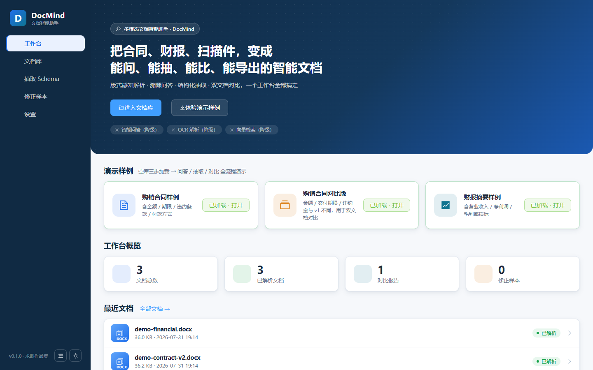
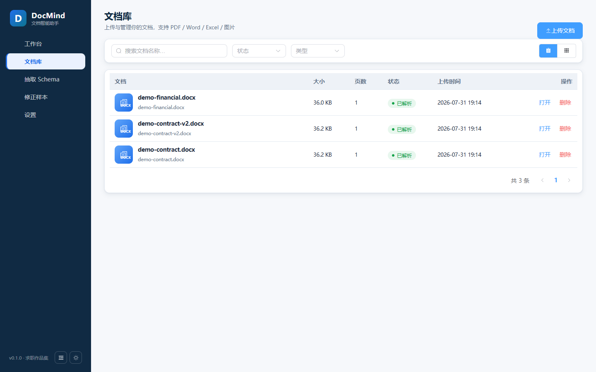

# DocMind 多模态文档智能助手


把合同、财报、扫描件变成「能问、能抽、能改、能导出」的智能文档——以**人机校验闭环**为核心差异的多模态文档智能助手。

> 求职作品集主项目（AI 应用开发工程师）· 需求与验收文档见 [docs/需求开发文档.md](docs/需求开发文档.md)




## 核心能力

| 能力 | 说明 |
|---|---|
| 版式感知解析 | PDF / Word / Excel / 图片（OCR 可选），标题层级、表格还原、图片提取、页码定位 |
| 智能分块 | 章节感知切块 + 文档结构树，块级溯源 |
| 溯源问答 | BM25 + 稠密向量 + RRF 融合检索，LLM 流式回答，引用可点击跳转原文并高亮 |
| 结构化抽取 | Schema 驱动字段抽取 + JSON 校验 + 字段级置信度，抽取结果可视化编辑 |
| 人机校验闭环 | 浏览器修正 → 确认快照 → 修正样本回流，持续改善抽取质量 |
| 多文档对比 | 同 Schema 字段级 diff + 章节相似度，支持报告导出 |
| 无 Key 可演示 | 规则抽取器 / 规则问答器降级，内置合同、财报样例，开箱即用 |

## 技术架构

```
浏览器 (Vue 3 + Vite + Element Plus + ECharts)
   │  REST / SSE 流式
   ▼
FastAPI 应用层（文档 / 任务 / 会话 / 抽取 / 对比 / 样例 / 设置 / 演示）
   │
   ├─ 解析层：pdfplumber · python-docx · openpyxl · PaddleOCR(可选)
   ├─ 检索层：BM25 + 稀疏/稠密向量 + RRF 融合
   ├─ LLM 适配层：OpenAI 兼容协议（DeepSeek 等），无 Key 自动降级规则引擎
   ├─ 抽取层：Schema 校验 + LLM 分批抽取 + 规则抽取器 + 置信度评估
   └─ 存储：SQLite（元数据）+ 文件目录（原件/图片/导出物）
部署：Docker Compose（Nginx 同源反代 /api + SSE 透传）· GitHub Actions CI
```

技术栈：Python 3.11 · FastAPI · SQLite · Vue 3 · Vite · Element Plus · ECharts · Docker · GitHub Actions

## 快速开始

### 方式一：本地开发

后端（Python 3.11）：

```bash
cd backend
pip install -r requirements.txt -r requirements-dev.txt
uvicorn app.main:app --reload --port 8000
```

前端（Node 20+）：

```bash
cd frontend
npm install
npm run dev   # http://localhost:5173 （已配置 /api 代理）
```

### 方式二：Docker 一键部署

```bash
docker compose up -d --build
# 打开 http://localhost:8080 （端口可用 DOCMIND_PORT 覆盖）
```

配置 LLM（可选）：在 `.env` 中设置 `DOCMIND_API_KEY` / `DOCMIND_BASE_URL` / `DOCMIND_MODEL`（OpenAI 兼容协议）。不配置则自动进入**无 Key 演示模式**——规则问答器与规则抽取器保证全部功能可跑通。

## 演示样例

启动后首页一键加载内置样例：

| 样例 | 说明 |
|---|---|
| 购销合同（v1） | 金额 / 期限 / 违约条款 / 付款方式 |
| 购销合同（v2） | 与 v1 金额 / 交付期限 / 违约金不同，用于双文档对比 |
| 财报摘要 | 营业收入 / 净利润 / 毛利率指标 |

## 项目结构

```
backend/
  app/
    api/        路由（文档/任务/会话/抽取/对比/样例/设置/演示/健康）
    services/   解析 / 分块 / 检索 / 问答 / 抽取 / 对比 / 导出
    llm/        OpenAI 兼容客户端 + 无 Key 降级
    fallback/   规则抽取器 / 规则问答器
    storage/    SQLite 与文件存储
    utils/      限流 / 日志 / 文本工具
  tests/        105 项 pytest（API / 解析 / 分块 / 检索 / 问答 / 抽取 / 对比）
frontend/
  src/
    views/      工作台 / 文档库 / 详情四页签 / Schema / 样本库 / 设置
    components/ 16 个业务组件（骨架屏/空态/错误态/状态徽标/置信度条…）
    composables/useTheme.js  主题（跟随系统/浅色/深色）
    styles/     main.css 设计令牌（§8.2）
docs/
  需求开发文档.md      需求 v2.0（功能验收 + 里程碑）
  design-walkthrough.md  M6 设计走查清单（§8.8 前端验收）
  code-review.md        M8 代码审查报告
```

## 质量保障

- 后端：105 项 pytest 全绿，ruff 零告警
- 前端：Vite 构建 + vitest 单测，§8.8 设计走查（暗色模式 / 响应式 / 状态完备）逐项验收
- CI：GitHub Actions 自动执行 pytest → ruff → 前端构建/测试 → Docker 镜像构建

## 里程碑

M1 骨架 → M2 解析层 → M3 问答层 → M4 抽取校验 → M5 对比演示 → M6 前端美观 → M7 部署工程化 → M8 质量门禁（详见 [docs/需求开发文档.md](docs/需求开发文档.md) §9）