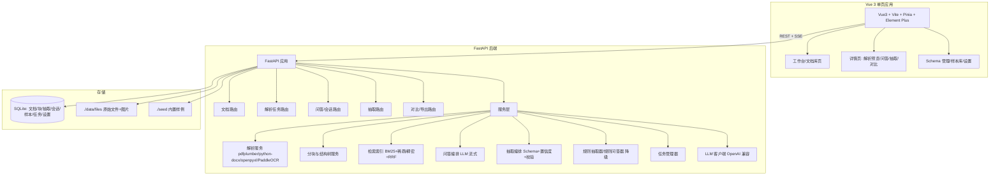
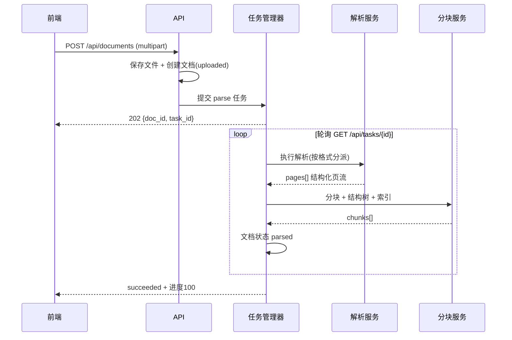
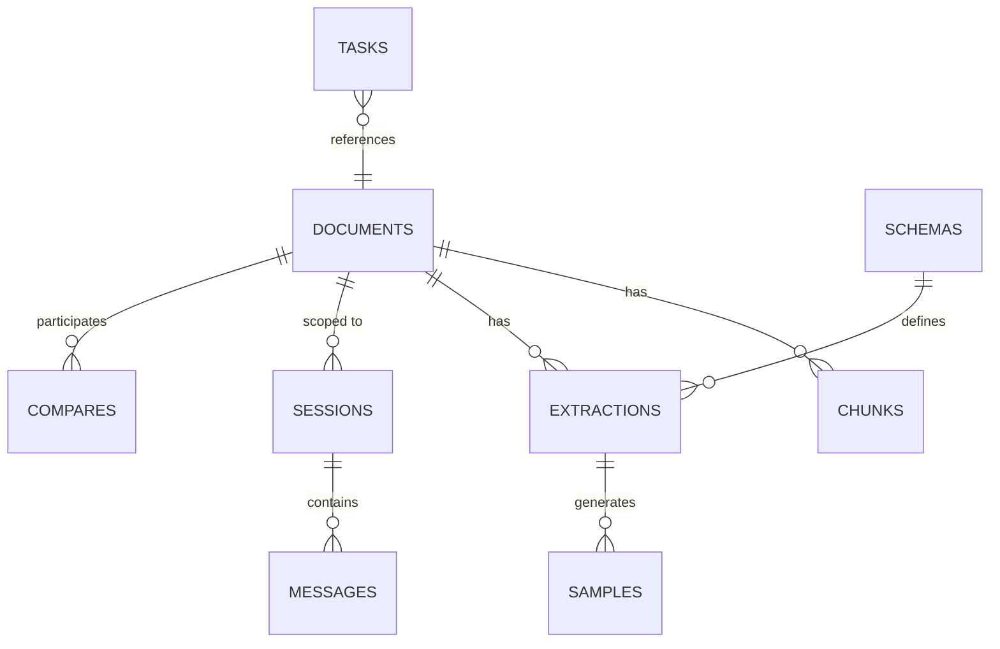

# DocMind 多模态文档智能助手 — 需求开发文档

| 项 | 内容 |
|---|---|
| 项目代号 | DocMind |
| 版本 | v2.0（细化基线） |
| 文档状态 | 定稿（唯一开发基线，替代 v1.0） |
| 作者 | 赵海蓺 |
| 定位 | 求职作品集主项目（AI 应用开发工程师） |
| 里程碑状态 | M1 骨架 ✅ / M2 解析层 ✅ / M3 检索问答层（进行中）/ M4~M8 未开始 |

| 修订记录 | 说明 |
|---|---|
| v1.0 | 初始基线：功能框架、架构、接口、前端设计、M1~M8 里程碑 |
| v2.0 | 细化基线：每个 FR 补充输入/处理流程/输出/边界条件/异常降级/验收标准；前端升级为组件级设计规范与可勾选走查清单；里程碑明确交付物与通过条件；全文不包含任何时间线 |

---

## 0. 文档使用约定

1. **无时间线**：本文档不含任何日期、工期、排期或工时估算；开发推进只以"里程碑 M1→M8"为序，每个里程碑有明确的交付物与验收标准，完成即进入下一个。
2. **需求优先级**：P0 = 核心演示闭环（缺一不可）；P1 = 产品完善（发布前完成）；P2 = 可选增强（有余力再做）。
3. **验收口径**：每条需求给出"验收标准"清单，验收 = 自动化测试通过 + 人工走查通过（前端按 §8.7 走查清单逐项打勾）。
4. **降级原则**：无 API Key / 无 OCR / 无 Embedding 时，系统必须仍能完成演示闭环，并在 UI 明示当前使用的降级模式（规则问答器 / 规则抽取器 / 解析降级提示）。
5. **术语表**：见 §2；**数据设计**见 §6；**接口设计**见 §7；**前端设计**见 §8；**里程碑**见 §9；**测试策略**见 §10。

---

## 1. 项目概述

### 1.1 背景与动机

- 现有作品集已覆盖**结构化数据智能**（SmartQA，NL2SQL）与**检索评测**（Agent Memory Lab），缺少企业 AI 应用落地中最高频的**非结构化文档智能**能力。
- 市场上大量"PDF 聊天机器人"只做"抽文本 → 向量检索 → 问答"，同质化严重；DocMind 的差异化在于：**版式感知解析 + 结构化抽取 + 置信度标注 + 人工校验闭环 + 多文档对比**。
- 目标岗位为 AI 应用开发工程师，需要展示从解析、检索、模型编排、后端 API 到美观前端的完整闭环，且**面试官无需 API Key 即可浏览器体验**。

### 1.2 产品定位（一句话）

> 把合同、财报、扫描件变成"能问、能抽、能改、能导出"的智能文档——以**人机校验闭环**为核心差异的多模态文档智能助手。

### 1.3 目标用户与使用场景

| 用户 | 场景 |
|---|---|
| 面试官/访客 | 打开演示地址，一键加载内置合同/财报/扫描件样例，体验上传 → 解析 → 问答 → 抽取 → 校验 → 导出全流程 |
| 企业业务人员（目标形态） | 上传合同/财报，问答合同条款、抽取关键字段、人工核对修正、导出结构化结果 |
| 开发者（自用） | 自定义抽取 Schema，管理模型配置，导入自己的文档 |

### 1.4 成功标准（验收口径）

1. **演示闭环**：无任何 API Key 的情况下，可在浏览器完成样例加载、解析、问答（检索可用）、抽取（演示规则抽取器）、校验、导出。
2. **多模态覆盖**：PDF（文本+表格+图片）、Word、Excel、图片（扫描件 OCR，可降级提示）四类输入可解析。
3. **抽取可用性**：内置合同 Schema 与财报 Schema 在样例文档上字段抽取完整率 ≥ 90%（人工确认前为 draft，确认后为 confirmed）。
4. **引用可溯源**：问答每条回答引用可点击跳转到原文位置（页码 + 章节）。
5. **工程质量**：后端测试 ≥ 60 项通过；前端生产构建与单测通过；Docker Compose 一键起服务；GitHub Actions 全绿。
6. **前端美观**：通过"设计走查清单"（见 §8.7），页面无丑陋默认样式、状态完备（空态/加载/错误/成功）。

### 1.5 范围边界

**做**：
- 上传与管理 PDF / DOCX / XLSX / 图片文档
- 版式感知解析（标题层级、表格还原、图片提取、页码）
- 智能分块 + 文档结构树
- 单/多文档 RAG 问答（引用溯源、流式输出、多轮会话）
- 基于 Schema 的结构化抽取（JSON 校验、置信度、依据引用）
- 人工校验闭环（编辑、确认、修正样本回流、样本库管理）
- 同 Schema 双文档对比（字段级 diff + 文本级差异）
- 导出（JSON / Excel / Markdown）
- 内置样例 + 演示模式
- 模型与检索设置管理

**不做（或明确降级）**：
- 不做用户注册/登录/多租户（单机单用户，作品集定位）
- 不做 .xls 老格式（提示转存 .xlsx）
- 不做扫描件高精度 OCR 训练；OCR 为可选依赖，缺失时降级提示
- 不做在线协作编辑（多人同时编辑）
- 不做云端部署收费、不做鉴权体系（演示环境开放，但提供关闭演示模式的开关）

---

## 2. 名词与术语

| 术语 | 含义 |
|---|---|
| 文档（Document） | 用户上传的原始文件及其解析、索引、抽取等派生数据的聚合体 |
| 块（Chunk） | 解析后切分的最小检索单元，含类型（text/table/image）、章节路径、页码 |
| 结构树（Structure Tree） | 文档分块后按标题层级构建的目录树 |
| Schema | 抽取目标的结构化定义（字段名、类型、必填、提示词等） |
| 抽取任务（Extraction） | 对某文档按某 Schema 执行抽取产生的结果（draft / confirmed） |
| 置信度（Confidence） | 字段级别的 0-1 分数，来自模型自评 + 规则校验 |
| 修正样本（Correction Sample） | 人工确认时与模型结果不一致的字段快照，用于后续评测 |
| 引用（Citation） | 回答中指向某 chunk（页码+章节+摘要）的溯源信息 |
| 任务（Task） | 后台异步执行的 parse/extract/compare/demo_load 作业，带状态与进度 |
| RRF | Reciprocal Rank Fusion，多路检索结果按名次倒数加权融合 |
| BM25 | 词频-逆文档频率的稀疏检索打分算法（本项目为纯 Python 实现） |
| SSE | Server-Sent Events，服务端单向流式推送（问答逐字输出） |
| 规则问答器 | 无 LLM Key 时的降级问答：检索命中块直接作为答案片段返回 |
| 规则抽取器 | 无 LLM Key 时的降级抽取：基于关键词/正则/表格规则的字段抽取 |
| 演示模式 | 内置样例 + 预置问题 + 规则降级，保证空环境可完整演示 |

---

---

## 3. 功能需求

### 3.0 需求总览

| 编号 | 需求 | 优先级 | 归属里程碑 | 状态 |
|---|---|---|---|---|
| FR-01 | 文档上传与管理 | P0 | M1/M2 | 已实现 |
| FR-02 | 版式感知解析 | P0 | M2 | 已实现 |
| FR-03 | 智能分块与结构树 | P0 | M2 | 已实现 |
| FR-04 | 文档问答（RAG） | P0 | M3 | 进行中 |
| FR-05 | Schema 管理 | P0 | M1/M4 | 部分实现 |
| FR-06 | 结构化抽取与校验闭环 | P0 | M4 | 未开始 |
| FR-07 | 修正样本库 | P1 | M4 | 未开始 |
| FR-08 | 多文档对比 | P1 | M5 | 未开始 |
| FR-09 | 内置样例与演示模式 | P0 | M5 | 未开始 |
| FR-10 | 模型与系统设置 | P0 | M1/M3 | 部分实现 |
| FR-11 | 问答会话管理 | P0 | M3 | 未开始 |
| FR-12 | 任务与进度 | P0 | M1 | 已实现 |
| FR-13 | 数据管理 | P1 | M5 | 未开始 |

### 3.1 FR-01 文档上传与管理

**功能目标**：把用户本地文件安全地接入系统，形成可解析、可检索、可抽取的文档资产。

**输入**
- 文件格式：`.pdf` `.docx` `.xlsx` `.png` `.jpg` `.jpeg` `.webp`
- 单文件大小：≤ 50MB；单次上传 ≤ 5 个文件
- 上传途径：拖拽上传 + 文件选择器（多选）

**处理流程**
1. 前端校验扩展名与大小，非法立即提示且不发起请求。
2. POST /api/documents（multipart），后端校验 MIME 与扩展名白名单。
3. 文件以 `uuid.ext` 落盘 `data/files/`，创建 Document 记录（status=uploaded）。
4. 自动提交 parse 任务，返回 202；任务完成后 status 流转 `uploaded → parsing → parsed | failed`。
5. 前端轮询任务（1s），卡片实时显示进度条与阶段文案；成功后刷新列表与详情。

**输出**
- 文档对象：`{id, name, filename, original_name, ext, mime, size_bytes, status, page_count, char_count, chunk_count, created_at, updated_at}`
- 上传响应 202：`{document: {...}, task: {id, kind: "parse", status: "pending"}}`

**边界条件**
- 同名文件：允许重复上传，展示名自动追加 `(2)`、`(3)` 后缀。
- 非法扩展名 / 超 50MB / 空文件（0 字节）：400 错误，前端 toast 明确原因。
- 解析失败：文档保留（status=failed + parse_error），允许"重新解析"，不允许删除失败信息。
- 删除文档：二次确认弹窗展示影响范围（关联块数/会话数/抽取数），确认后级联删除块、抽取、会话、文件与图片。
- 重新解析：仅 uploaded/failed/parsed 状态可触发；parsing 中禁止重复提交。

**异常与降级**
- 磁盘写入失败 → 500 + 用户可读错误；不残留半写入文件。
- 任务中断（服务重启）→ 重启时未完成任务标记 failed，提示"服务重启，任务中断，请重试"。

**验收标准**
- [ ] 5 个格式样例（pdf/docx/xlsx/png/jpg）上传后均创建成功并自动开始解析
- [ ] 非法文件（.exe、无扩展名）被拒绝且有明确提示
- [ ] 51MB 文件被拒绝；0 字节文件被拒绝
- [ ] 同名上传两次得到两个文档（展示名区分）
- [ ] 删除文档后，DB 无残留 chunks/extractions/sessions，文件系统中文件与图片被清理
- [ ] 解析失败文档可重新解析并成功

### 3.2 FR-02 版式感知解析

**功能目标**：把异构文件解析为"结构化页流 pages[]"，保留版式信息（标题层级、表格、图片、页码），是检索与抽取的质量底座。

**输入与解析器**

| 格式 | 解析器 | 说明 |
|---|---|---|
| PDF | pdfplumber | 文本、表格、图片、页码、字号/坐标 |
| DOCX | python-docx | 按 Word 样式识别标题层级，表格转 Markdown |
| XLSX | openpyxl | 每个工作表转为表格块，首行作为表头 |
| 图片 | PaddleOCR（可选依赖） | 扫描件 OCR；未安装时文档可创建但解析失败并给出安装指引 |
| 图片（备选） | 视觉 LLM（可配置） | 支持视觉输入的 OpenAI 兼容模型，可在无 OCR 时经 API 识别 |

**版式感知规则**
1. **标题识别**：PDF 用字号 + 加粗 + 位置启发式；DOCX 用段落样式（Heading 1-3）；正则兜底（如"第X章/1.1/一、"）。
2. **表格还原**：pdfplumber 表格提取后转为 Markdown 表格（对齐表头、近似合并单元格）；表格独立成块，不混入正文。
3. **图片提取**：PDF 图片保存为文件，生成缩略图；块元数据记录图片路径与上下文标题。
4. **页码**：所有块携带页码（PDF 原生页码；DOCX/XLSX 近似为 1）。
5. **质量过滤**：页眉页脚/重复文本启发式去重；空页跳过；乱码检测（U+FFFD 或异常替换字符占比 > 5% 时告警并跳过该页）。
6. **解析产物**：结构化页流 pages[]（每页 blocks[]，block 含 kind/bbox/text/table/image_path/heading_level），落库并可在前端"解析预览"查看。

**处理流程**
1. 任务管理器取 parse 任务 → 按扩展名分派解析器。
2. 解析器逐页/逐段落产出原始块流，边解析边更新任务进度（"正在解析第 x/y 页"）。
3. 质量过滤（去页眉页脚、空页、乱码页）。
4. 产出 pages[] 落库（documents_pages 或派生块），统计 page_count/char_count。
5. 交给分块服务（FR-03）切块、建树、建索引；全部成功 → 文档 parsed。

**输出**
- `GET /api/documents/{id}/pages`：分页页流（每页含 blocks 数组）
- 文档统计：page_count、char_count、chunk_count

**边界条件**
- 加密/损坏 PDF：解析失败，parse_error 提示"文件损坏或已加密，请重新导出后上传"。
- 空文档（0 页/0 段）：解析成功但 block_count=0，前端显示"未解析到内容"空态。
- 超大 PDF（>100 页）：允许解析，任务进度必须持续更新，禁止假死。
- XLSX 多工作表：每个工作表独立成 table 块。
- DOCX 无样式纯文本：标题识别走正则兜底，正文按段落分块。

**异常与降级**
- OCR 未安装 + 无视觉模型：解析失败，error 文案含安装指引与配置视觉模型的入口链接。
- 单个文件解析抛异常：任务 failed，文档留存在 uploaded/failed 状态，不污染其他文件。

**验收标准**
- [ ] 内置合同 PDF：标题层级正确（≥3 级）、表格还原为 Markdown 且数字无损
- [ ] 内置财报 PDF：营业收入/净利润等数字与原文一致（逐格对比）
- [ ] DOCX 样例：Heading 样式段落被识别为标题，表格独立成块
- [ ] XLSX 样例：每个工作表生成 table 块，首行为表头
- [ ] 图片样例：有 OCR 时输出文本块；无 OCR 时解析失败并给出安装指引文案
- [ ] 乱码检测：人为构造 U+FFFD 页面被跳过并记录告警
- [ ] 页眉页脚不进入正文块

### 3.3 FR-03 智能分块与结构树

**功能目标**：把页流切成"检索友好 + 溯源友好"的块，并构建章节树供目录导航与引用定位。

**分块策略（按优先级）**
1. 以标题层级为边界切分（h1/h2/h3 之间的正文合并为一个块）
2. 表格独立成块（kind=table）
3. 图片块：图片 + 所在章节标题上下文（kind=image）
4. 长块截断：块内容上限 1500 字符，按句子边界（。！？；换行）切分
5. 短块合并：相邻同章节碎片（< 80 字符）合并

**块元数据**：`doc_id, seq, kind, section_path, title, content, page, char_count, token_estimate, image_path, hash_vec`

**处理流程**
1. 接收页流 → 按标题层级聚合正文 → 表格/图片独立块。
2. 长块按句子边界截断，短块向相邻块合并。
3. 按块顺序生成 seq；构建章节树（章节 → 子章节 → 块引用）。
4. 计算 token_estimate（中英混合估算：中文字符 + 英文单词数 ×1.3）。
5. 构建检索索引（见 §6.4）：BM25 词频表 + 稀疏 hash 向量；可选稠密向量。
6. 块与结构树落库，更新文档 chunk_count。

**输出**
- `GET /api/documents/{id}/structure`：结构树 JSON
- `GET /api/documents/{id}/chunks`：分页块列表

**边界条件**
- 正文没有标题：全部正文合并为一个大块（超长则按句子截断），section_path="未命名章节"。
- 连续多个标题：空章节允许存在但前端折叠显示。
- 表格紧邻标题：表格块 section_path 归入前一个标题。
- 图片块无标题上下文：section_path 取文档名。

**验收标准**
- [ ] 合同样例分块数 8~30 且章节归属正确
- [ ] 表格块不混入正文块（kind 正确）
- [ ] 结构树与文档目录一致，点击章节可定位到对应块
- [ ] 短块合并：无连续两个 <80 字符的同章节 text 块
- [ ] 长块截断：所有 text 块 ≤ 1500 字符且不在句子中间硬切（允许在句号/换行处切）

### 3.4 FR-04 文档问答（RAG）

**功能目标**：对单/多文档做可溯源的流式问答，是"能问"的核心体验。

**检索**
- 默认检索：**BM25（纯 Python 实现）+ 稠密向量（可配置 API Embedding）→ RRF 融合**，top_k 默认 6（可配置 3-10）
- 无 Embedding Key 时自动降级为 BM25 + 稀疏 hash 表征，保证演示可跑
- 检索范围：单文档（默认）或勾选多文档（跨文档检索）
- 检索过滤：可选仅文本块 / 包含表格块；按页码范围过滤（P2）

**生成**
- 上下文组装：引用块 + 文档名/章节路径/页码；上下文按 token 预算裁剪（默认 8k，可配置）
- 输出：SSE 流式文本；回答中标注引用 [1] [2]；引用列表含 chunk_id、页码、章节标题
- 规则：检索不到相关内容时必须回答"未在文档中找到相关信息"，禁止编造；回答语言跟随提问语言
- 多轮：会话上下文携带最近 8 轮消息；支持追问
- 无 Key 降级：**规则问答器**（BM25 检索 + 命中块直接作为答案片段返回），UI 标注"演示检索模式"

**处理流程（LLM 模式）**
1. 前端 POST /api/documents/{id}/chat?stream=true，携带 session_id（可选）、question、doc_ids。
2. 后端检索（BM25 + 可选稠密 → RRF）→ top_k 块。
3. 组装 system prompt + 引用上下文 + 最近 8 轮历史 + 当前问题。
4. 调 LLM 流式接口，SSE 逐段推送 delta；token 级流式由后端转发。
5. 结束事件 done 携带 citations、source、usage；消息落库。

**处理流程（规则模式）**
1. 检索 top_k 块。
2. 若最高分低于阈值（默认 0.15）→ 返回"未在文档中找到相关信息"。
3. 否则取 top 1~3 块内容拼接为回答片段，citations 指向命中的块，source=rule。

**输出**
- SSE 事件流：meta → delta×n → done | error（协议见 §7.4）
- 消息记录：role/content/citations/source

**边界条件**
- 空问题 / 纯空白问题：400。
- 文档未解析（uploaded/failed）：409，提示"请先完成解析"。
- 检索 0 命中：回答"未在文档中找到相关信息"，citations 为空。
- 多文档问答：doc_ids 中任一文档未解析 → 409。
- 超长问题（>2000 字符）：截断并提示。
- LLM 网络超时：SSE error 事件，消息标记失败，前端可"重试"。
- 流中断（客户端断开）：服务端停止生成，已生成消息落库。

**验收标准**
- [ ] 预置 10 个演示问题全部能命中正确原文并带引用（规则模式下）
- [ ] 引用跳转定位准确（chunk_id → 页码 + 章节 + 原文高亮）
- [ ] 流式输出在前端逐字渲染，无整段等待
- [ ] 多轮追问：第二次提问能引用前文上下文
- [ ] 无 Key 时 UI 显示"演示检索模式"提示条
- [ ] 检索不到的问题（如"文档里没有的字段"）不编造

### 3.5 FR-05 Schema 管理

**功能目标**：定义"从文档里抽什么"，支持内置与自定义 Schema，是抽取（FR-06）与对比（FR-08）的配置基础。

**FieldDef 结构**
```json
{
  "key": "contract_amount", "label": "合同金额", "type": "number",
  "required": true, "description": "合同总金额（人民币元）",
  "example": "1200000", "prompt_hint": "包含大小写金额，取大写数字金额", "enum": []
}
```
type 取值：`string / number / date / list / enum / boolean`。

**处理流程**
1. 内置 Schema（contract/financial）随启动种子写入，is_builtin=1，不可删除，可查看。
2. 自定义 Schema：表单模式或 JSON 模式创建/编辑；校验通过后落库。
3. 删除自定义 Schema：若被 extraction 引用则软阻止（提示"已有抽取结果引用，请先删除相关抽取"）；未被引用则硬删。

**校验规则**
- key 唯一（表级 UNIQUE）；key 格式 `^[a-z][a-z0-9_]{0,49}$`
- label 非空；type 合法；required 为布尔
- list 类型字段必须有 description 说明元素格式；enum 类型字段必须有非空 enum 数组

**验收标准**
- [ ] 内置 contract/financial Schema 存在且字段完整（见附录 §11.3）
- [ ] 非法 Schema（重复 key / 非法 type / 空 label）被拒绝并指出具体字段
- [ ] 表单/JSON 双模式编辑互通：切换不丢数据
- [ ] 被引用 Schema 删除被阻止

### 3.6 FR-06 结构化抽取与校验闭环

**功能目标**：按 Schema 从文档抽取结构化字段，带置信度与依据，人工编辑确认后形成可信数据——这是 DocMind 的差异化核心。

**处理流程**
1. 用户选择 Schema → POST /api/documents/{id}/extract → 202 + task。
2. 任务执行：
   - LLM 模式：检索相关块（top_k 12）→ 分批送入 LLM（每批 ≤ 8 个字段）→ JSON 输出校验/修复 → 字段置信度（模型自评 + 规则校验）
   - 规则模式：规则抽取器基于关键词/正则/表格位置抽取，置信度按命中强度计算
3. 结果落库 extractions（status=draft，source=llm|rule），字段状态 extracted/unsure/missing/invalid。
4. 前端展示结果表：字段 | 值 | 置信度 | 状态 | 依据（可点击溯源）。
5. 人工编辑字段值 → PUT 保存草稿；编辑后该字段 confidence 置空、status=edited。
6. 点击"确认结果"（二次确认弹窗：提示将生成修正样本）→ POST confirm：
   - 对模型值 ≠ 人工值的字段生成修正样本（FR-07）
   - extraction status=confirmed，confirmed_at 落库
   - 已确认的抽取不可被重新抽取静默覆盖（需显式操作并二次确认）

**置信度规则**
- LLM 字段自评 c∈[0,1]；若与规则校验冲突（如 number 解析失败）→ c×0.5 并 status=invalid
- 规则模式：关键词命中 0.6~0.9、正则精确 0.9+、表格定位命中 0.85
- 阈值：≥0.8 高 / 0.5~0.8 中 / <0.5 低；前端颜色绿/黄/红

**输出**
- Extraction 对象：`{id, doc_id, schema_id, status, data, confidence, field_status, citations, source, confirmed_at}`
- 导出：JSON / Excel / Markdown（接口见 §7）

**边界条件**
- 文档未解析 → 409；Schema 不存在 → 404；重复提交抽取（同 doc+schema 有 running 任务）→ 409
- LLM 输出非法 JSON：最多重试 2 次（含 JSON 修复提示词）；仍失败则该批字段 status=invalid
- 字段缺失：status=missing，值置 null，不阻塞整体完成
- 已 confirmed 的抽取重新抽取：需前端二次确认，且旧结果归档为历史（保留 confirmed_at 快照）
- 编辑值类型校验：number 必须可转数值；enum 必须在枚举内；date 必须 ISO 格式

**验收标准**
- [ ] 合同样例 15 字段抽取完整率 ≥ 90%（人工确认前 draft，确认后 confirmed）
- [ ] 财报样例指标字段数值与原文一致
- [ ] 每个字段有置信度与依据引用；点击依据可定位原文
- [ ] 编辑保存草稿后刷新不丢；确认后 samples 表按差异字段生成记录
- [ ] 无 Key 时规则抽取器可完成演示闭环，UI 标注"规则抽取模式"

### 3.7 FR-07 修正样本库

**功能目标**：沉淀"模型错了、人改对了"的字段级样本，用于展示数据飞轮与后续评测。

**样本字段**：`extraction_id, doc_id, schema_id, field_key, model_value, human_value, citation`

**功能点**
- 列表：文档 | Schema | 字段 | 模型值 | 人工值 | 时间；支持按 Schema/字段过滤、分页
- 导出 JSONL：`GET /api/samples/export`
- 删除单条/清空（二次确认）
- 确认抽取时自动生成：模型值 ≠ 人工值 的字段才产生样本

**验收标准**
- [ ] 确认一个含 2 处人工修改的抽取 → 样本库新增 2 条且值正确
- [ ] 全自动确认（无修改）→ 不产生样本
- [ ] JSONL 导出可被 pandas 直接读入

### 3.8 FR-08 多文档对比

**功能目标**：同 Schema 的两份文档（如两版合同/两份财报）自动比对差异，输出字段级 diff 与章节相似度。

**处理流程**
1. 选择当前文档 A + 目标文档 B（下拉仅列出已解析且已有同 Schema 抽取的文档）+ Schema → POST /api/compare → 202。
2. 任务执行：取 A/B 的 extraction 数据 → 字段级 diff；取 A/B 的 chunks 按章节对齐 → 文本相似度（字符级 Jaccard/编辑距离归一化）。
3. 结果落库 compares 表；可选 LLM 生成差异摘要（无 Key 时 rule 摘要：列出 changed 字段清单）。
4. 前端展示：字段差异表 + 章节差异列表 + 摘要卡片；导出 MD/HTML 报告。

**字段 diff 状态**：`same / changed / only_a / only_b`
- changed 且数值型：计算 delta_pct（如金额 +8.3%）

**章节相似度**：标题对齐后，正文内容归一化相似度 ∈[0,1]；<0.6 视为 changed，≥0.6 视为 same。

**验收标准**
- [ ] 两版合同样例：金额变更被检出并显示 delta_pct
- [ ] 章节相似度符合人工判断（大改章节 <0.6，微调章节 ≥0.6）
- [ ] 导出报告包含全部字段与章节差异，可离线阅读

### 3.9 FR-09 内置样例与演示模式

**功能目标**：访客 30 秒内零配置体验全流程。

**内置样例**（seed/ 目录）
- `demo-contract.pdf` 购销合同（含金额、期限、付款方式、违约金等表格）
- `demo-financial.pdf` 财报摘要（含营业收入、净利润等指标表格）
- `demo-invoice.png` 扫描发票（OCR 依赖，缺失时提示）

**功能点**
- 一键加载：演示页三个样例卡片 → 点击 → 复制种子文件 → 自动解析 → 跳转详情
- 预置问题：问答页"示例问题"卡片（点击直接提问），覆盖条款查询、金额计算、指标对比
- 预置 Schema：合同/财报已内置；演示模式不限制用户上传自己的文档

**验收标准**
- [ ] 全新环境（空库）点三次卡片即可完成全流程演示，无需任何配置
- [ ] demo_load 任务失败时样例卡片显示错误并允许重试

### 3.10 FR-10 模型与系统设置

**功能点**
- 模型配置：供应商预设（OpenAI / DeepSeek / 自定义 OpenAI 兼容）、Base URL、API Key（保存时脱敏显示，不回传明文）、模型名、temperature（0-2）、max_tokens
- 检索配置：top_k、RRF 融合权重、块长度上限、是否启用稠密检索
- 测试连接：按钮调用 /v1/models 或最小 completion 验证配置，成功/失败 toast
- 数据管理：清空全部数据（输入"DELETE"二次确认）；导出全部数据（P2，打包 zip）
- 配置持久化到 SQLite settings 表；启动时加载为全局配置

**验收标准**
- [ ] 保存设置后重启服务配置仍在
- [ ] API Key 保存后 GET 不回传明文（仅掩码 `sk-****abcd`）
- [ ] 测试连接对错误 Key/网络不通给出明确错误
- [ ] 清空数据需输入 DELETE 且清空后样例可重新加载

### 3.11 FR-11 问答会话管理

**功能点**
- 会话 CRUD：创建（标题自动取首问前 20 字）、列表、删除
- 消息持久化：role / content / citations / source / created_at
- 会话绑定文档集合（doc_ids）；切换文档集合时新建会话或复用
- 删除会话：二次确认；级联删除消息

**验收标准**
- [ ] 新会话首次提问后标题自动生成
- [ ] 刷新页面后历史消息完整恢复，引用可继续点击
- [ ] 会话切换/删除操作正确，删除后消息级联清理

### 3.12 FR-12 任务与进度

**功能点**
- 任务类型：parse / extract / compare / demo_load
- 状态机：pending → running → succeeded | failed；失败携带用户可读 error
- 进度：0-100 + 阶段消息（如"正在解析第 3/12 页"）
- 前端：任务提交后轮询（1s）；解析/抽取完成后自动刷新对应页面
- 服务端：任务表持久化；重启后未完成任务标记 failed（"服务重启，任务中断"）

**验收标准**
- [ ] 四种任务均能创建、轮询、完成
- [ ] 失败任务 error 为用户可读文案，前端展示并可重试
- [ ] 服务重启后 pending/running 任务变为 failed

### 3.13 FR-13 数据管理

**功能点**
- 危险操作（删除全部文档/清空样本库/重置设置）需要二次确认
- 删除文档确认弹窗展示影响范围（关联块数、会话数）
- 重置设置：恢复默认模型/检索配置

**验收标准**
- [ ] 所有危险操作均需二次确认，误点不会直接执行
- [ ] 删除后数据库与文件系统无残留

---

## 4. 非功能需求

| 编号 | 类别 | 要求 |
|---|---|---|
| NFR-1 | 可演示性 | 无 API Key 时全流程可用（规则抽取器/规则问答器/OCR 降级提示），演示不依赖外网模型服务 |
| NFR-2 | 性能 | 10MB PDF 解析 ≤ 30s（单线程）；问答首 token ≤ 5s（含检索）；抽取 30 页文档 ≤ 3 分钟 |
| NFR-3 | 安全 | 所有上传文件仅存本地；文件名校验防路径穿越；API 限流（默认 60 req/min/IP）；Key 不回传前端明文 |
| NFR-4 | 可观测 | 结构化日志（loguru）：任务/模型调用耗时与 token 计数；/api/health 提供版本与存储状态 |
| NFR-5 | 可测试性 | 解析器、检索、抽取服务均以纯函数/服务类封装，可注入 mock LLM/OCR；测试使用临时目录与临时 SQLite |
| NFR-6 | 可部署性 | environment.yml + Dockerfile + docker-compose（后端+前端同源）+ Nginx；CI：pytest + 前端构建 + 镜像构建 |
| NFR-7 | 兼容性 | Python 3.11/3.12；Node 18+；Chrome/Edge 最新版；响应式布局适配 1280px+ 桌面 |
| NFR-8 | 数据一致性 | 删除文档级联清理；confirmed 抽取不可被重新抽取静默覆盖（需显式操作） |
| NFR-9 | 优雅降级 | OCR 缺失 / Embedding 缺失 / LLM Key 缺失 / 网络失败 均有明确 UI 提示与回退路径 |
| NFR-10 | 代码质量 | ruff 零告警；后端测试全绿；前端 vitest 全绿 + 生产构建通过；关键路径函数有类型注解 |

**性能基准（验收口径）**
- 10MB 文本 PDF：解析 ≤ 30s；问答检索 ≤ 1s（本地规则模式）
- 100 页文档：任务进度每 ≤2s 更新一次
- 前端首屏可交互 ≤ 3s（本地构建产物）

**安全细则**
- 文件名清洗：仅保留 `[a-zA-Z0-9._-]`，存储名一律 uuid
- 静态媒体访问仅允许 data 目录内解析器登记的文件
- 限流中间件默认 60 req/min/IP（健康检查与 SSE 除外）

---

## 5. 系统架构

### 5.1 总体架构



### 5.2 模块划分与职责

| 模块 | 路径 | 职责 |
|---|---|---|
| API 层 | `backend/app/api/` | 路由、请求校验、响应模型、SSE |
| 服务层 | `backend/app/services/` | 解析、分块、索引、问答、抽取、对比、导出、任务 |
| 数据层 | `backend/app/storage/` | SQLite DAO、文件存储、种子数据 |
| 模型层 | `backend/app/models.py` | Pydantic 模型 + 状态枚举 |
| LLM 层 | `backend/app/llm/` | OpenAI 兼容客户端、提示词模板、流式解析、JSON 修复 |
| 降级层 | `backend/app/fallback/` | 规则抽取器、规则问答器、hash 嵌入 |
| 工具 | `backend/app/utils/` | 日志、限流、文件安全、文本工具 |
| 前端 | `frontend/` | Vue 3 应用（页面/组件/状态/API 封装） |
| 部署 | `deploy/` | Dockerfile、docker-compose.yml、nginx.conf |
| 测试 | `backend/tests/` `frontend/src/__tests__/` | 单元/集成测试 |
| 文档 | `docs/` | 需求文档、README、架构说明 |
| 样例 | `seed/` | 内置演示文档 |

### 5.3 技术选型与理由

| 层 | 选型 | 理由 |
|---|---|---|
| 后端 | Python 3.11 + FastAPI + uvicorn | 与现有作品一致，异步友好，SSE 原生支持 |
| 解析 | pdfplumber / python-docx / openpyxl | 纯 Python、表格与坐标能力强、离线 |
| OCR | PaddleOCR（可选依赖） | 中文扫描件效果好；缺失时优雅降级 |
| 存储 | SQLite（stdlib sqlite3 + 薄 DAO） | 单机作品零运维，JSON 字段灵活，避免 ORM 魔法 |
| 检索 | 自研 BM25 + hash 稀疏 + RRF；稠密可选 | 无重型向量库依赖，可离线可复现，体现检索功底 |
| 模型 | OpenAI 兼容 HTTP 客户端（httpx） | 兼容 DeepSeek/OpenAI/本地 Ollama，不绑定 LangChain |
| 前端 | Vue 3 + Vite + Pinia + Vue Router + Element Plus + ECharts | 与现有作品一致；ECharts 用于财报指标可视化 |
| 部署 | Docker Compose + Nginx 同源 + GitHub Actions | 浏览器演示闭环与 CI 全绿 |
| 测试 | pytest / httpx TestClient / vitest | 后端 + 前端双层质量门禁 |

### 5.4 核心流程

**解析流程**



**问答流程**：提问 → 检索 top_k（BM25+稠密+RRF）→ 组装上下文 → LLM 流式生成 → SSE 推送 tokens + citations（结束事件携带引用列表）→ 前端渲染 Markdown + 引用角标。

**抽取校验流程**：选择 Schema → 提交抽取任务 → 分批 LLM 抽取 → JSON 校验/置信度 → draft 落库 → 前端编辑 → 确认 → confirmed 快照 + 修正样本入库。

**对比流程**：选择同 Schema 双文档 → 字段级 diff + 章节相似度 → 差异摘要（可选 LLM）→ 结果表 + 导出。

---

## 6. 数据设计

### 6.1 实体关系



### 6.2 表结构（SQLite DDL）

```sql
CREATE TABLE documents (
  id INTEGER PRIMARY KEY AUTOINCREMENT,
  name TEXT NOT NULL,            -- 展示名（去扩展名）
  filename TEXT NOT NULL,        -- 存储文件名（uuid.ext）
  original_name TEXT NOT NULL,
  ext TEXT NOT NULL,
  mime TEXT,
  size_bytes INTEGER NOT NULL,
  status TEXT NOT NULL DEFAULT 'uploaded',  -- uploaded/parsing/parsed/failed
  parse_error TEXT,
  page_count INTEGER,
  char_count INTEGER,
  chunk_count INTEGER,
  created_at TEXT NOT NULL,
  updated_at TEXT NOT NULL
);

CREATE TABLE chunks (
  id INTEGER PRIMARY KEY AUTOINCREMENT,
  doc_id INTEGER NOT NULL REFERENCES documents(id) ON DELETE CASCADE,
  seq INTEGER NOT NULL,
  kind TEXT NOT NULL DEFAULT 'text',  -- text/table/image
  section_path TEXT,                  -- 如 "3.2 付款方式"
  title TEXT,
  content TEXT NOT NULL,
  page INTEGER,
  char_count INTEGER,
  token_estimate INTEGER,
  image_path TEXT,                    -- kind=image 时
  hash_vec TEXT,                      -- JSON 稀疏向量（降级稠密）
  created_at TEXT NOT NULL
);
CREATE INDEX idx_chunks_doc ON chunks(doc_id, seq);

CREATE TABLE schemas (
  id INTEGER PRIMARY KEY AUTOINCREMENT,
  key TEXT UNIQUE NOT NULL,           -- contract/financial/custom
  name TEXT NOT NULL,
  description TEXT,
  fields_json TEXT NOT NULL,          -- [FieldDef...]
  is_builtin INTEGER NOT NULL DEFAULT 0,
  created_at TEXT NOT NULL
);

CREATE TABLE extractions (
  id INTEGER PRIMARY KEY AUTOINCREMENT,
  doc_id INTEGER NOT NULL REFERENCES documents(id) ON DELETE CASCADE,
  schema_id INTEGER NOT NULL REFERENCES schemas(id),
  status TEXT NOT NULL DEFAULT 'draft',   -- draft/confirmed
  data_json TEXT,                         -- {field_key: value}
  confidence_json TEXT,                   -- {field_key: 0-1}
  field_status_json TEXT,                 -- {field_key: extracted/unsure/missing/invalid/edited}
  citations_json TEXT,                    -- {field_key: [chunk_id...]}
  source TEXT NOT NULL DEFAULT 'llm',     -- llm/rule
  llm_raw TEXT,                           -- 模型原始输出（调试）
  error TEXT,
  confirmed_at TEXT,
  created_at TEXT NOT NULL,
  updated_at TEXT NOT NULL
);

CREATE TABLE samples (
  id INTEGER PRIMARY KEY AUTOINCREMENT,
  extraction_id INTEGER REFERENCES extractions(id) ON DELETE SET NULL,
  doc_id INTEGER NOT NULL,
  schema_id INTEGER NOT NULL,
  field_key TEXT NOT NULL,
  model_value TEXT,
  human_value TEXT NOT NULL,
  citation TEXT,
  created_at TEXT NOT NULL
);

CREATE TABLE sessions (
  id INTEGER PRIMARY KEY AUTOINCREMENT,
  title TEXT NOT NULL,
  doc_ids TEXT NOT NULL DEFAULT '[]',   -- JSON 数组
  created_at TEXT NOT NULL
);

CREATE TABLE messages (
  id INTEGER PRIMARY KEY AUTOINCREMENT,
  session_id INTEGER NOT NULL REFERENCES sessions(id) ON DELETE CASCADE,
  role TEXT NOT NULL,                   -- user/assistant/system
  content TEXT NOT NULL,
  citations_json TEXT,                  -- [Citation...]
  source TEXT DEFAULT 'llm',            -- llm/rule
  created_at TEXT NOT NULL
);

CREATE TABLE tasks (
  id INTEGER PRIMARY KEY AUTOINCREMENT,
  kind TEXT NOT NULL,                   -- parse/extract/compare/demo_load
  status TEXT NOT NULL DEFAULT 'pending', -- pending/running/succeeded/failed
  progress INTEGER NOT NULL DEFAULT 0,
  message TEXT,
  payload_json TEXT,                    -- 任务参数（doc_id 等）
  result_json TEXT,                     -- 结果摘要（如 extraction_id）
  error TEXT,
  created_at TEXT NOT NULL,
  finished_at TEXT
);

CREATE TABLE compares (
  id INTEGER PRIMARY KEY AUTOINCREMENT,
  doc_a INTEGER NOT NULL,
  doc_b INTEGER NOT NULL,
  schema_id INTEGER NOT NULL,
  result_json TEXT NOT NULL,            -- {field_diff, section_diff, summary, source}
  created_at TEXT NOT NULL
);

CREATE TABLE settings (
  key TEXT PRIMARY KEY,
  value_json TEXT NOT NULL
);
```

### 6.3 关键 JSON 结构

**Chunk**
```json
{
  "id": 12, "doc_id": 1, "seq": 4, "kind": "table",
  "section_path": "3. 合同主要条款", "title": "3.2 付款方式",
  "content": "| 付款阶段 | 比例 | 时间 |\n|---|---|---|\n| 预付款 | 30% | 合同签订后5日内 |",
  "page": 3, "char_count": 220, "token_estimate": 90
}
```

**FieldDef（Schema 字段）**
```json
{
  "key": "contract_amount", "label": "合同金额", "type": "number",
  "required": true, "description": "合同总金额（人民币元）",
  "example": "1200000", "prompt_hint": "包含大小写金额，取大写数字金额", "enum": []
}
```

**Extraction（draft）**
```json
{
  "id": 3, "doc_id": 1, "schema_id": 1, "status": "draft", "source": "llm",
  "data": {"contract_amount": 1200000.0, "party_a": "华信科技有限公司"},
  "confidence": {"contract_amount": 0.95, "party_a": 0.88},
  "field_status": {"contract_amount": "extracted", "payment_method": "missing"},
  "citations": {"contract_amount": [12, 13]}
}
```

**Citation**
```json
{"chunk_id": 12, "page": 3, "section": "3.2 付款方式", "snippet": "预付款 30%..."}
```

**Task 载荷示例**
```json
{"kind": "parse", "payload": {"doc_id": 1}, "result": {"page_count": 12, "chunk_count": 21}}
{"kind": "extract", "payload": {"doc_id": 1, "schema_id": 2}, "result": {"extraction_id": 3}}
{"kind": "demo_load", "payload": {"sample": "contract"}, "result": {"doc_id": 5}}
```

### 6.4 检索索引设计

- **BM25**：纯 Python 实现（tokenize 中文按 2-gram + 英文按词），构建 doc 频次表；查询时 top_k 召回
- **稀疏 hash 表征**：hash(token) % 4096 的计数向量，余弦相似度（降级"稠密"）
- **稠密向量（可选）**：OpenAI 兼容 /embeddings，存 JSON 数组
- **RRF 融合**：score = Σ 1/(k + rank_i)，k=60；top_k 默认 6
- 索引在解析完成后构建，存于内存 + 可从 chunks 表重建（重启不丢）
- 更新策略：文档删除/重新解析时，索引中对应文档条目整体替换

---

## 7. 接口设计

### 7.1 通用约定

- 前缀 /api；JSON 响应；错误格式 {"detail": "用户可读信息"}（FastAPI 默认）
- 分页：?page=1&page_size=20 → {"items": [...], "total": n}
- 时间：ISO 8601 字符串（UTC+8 本地时间）
- SSE 端点返回 text/event-stream
- 异步任务类接口一律 202 + task 对象；前端轮询 /api/tasks/{id}

### 7.2 接口清单

| 方法 | 路径 | 说明 | 里程碑 |
|---|---|---|---|
| GET | /api/health | 健康检查（版本/存储状态/功能可用性） | M1 ✅ |
| POST | /api/documents | 上传文档（multipart）→ 202 | M2 ✅ |
| GET | /api/documents | 文档列表（搜索/过滤/分页） | M2 ✅ |
| GET | /api/documents/{id} | 文档详情 | M2 ✅ |
| DELETE | /api/documents/{id} | 删除（级联） | M2 ✅ |
| POST | /api/documents/{id}/reparse | 重新解析 | M2 ✅ |
| GET | /api/documents/{id}/structure | 结构树 | M2 ✅ |
| GET | /api/documents/{id}/chunks | 块列表（分页） | M2 ✅ |
| GET | /api/documents/{id}/pages | 解析页流（解析预览） | M2 ✅ |
| GET | /api/media/{doc_id}/{filename} | 图片/缩略图静态访问 | M2 ✅ |
| POST | /api/documents/{id}/chat | 问答（JSON 或 SSE 流式） | M3 |
| GET/POST | /api/sessions | 会话列表/创建 | M3 |
| GET | /api/sessions/{id}/messages | 消息列表 | M3 |
| DELETE | /api/sessions/{id} | 删除会话 | M3 |
| GET/POST | /api/schemas | Schema 列表/创建 | M1 ✅/M4 |
| GET/PUT/DELETE | /api/schemas/{id} | Schema 详情/更新/删除 | M1 ✅/M4 |
| POST | /api/documents/{id}/extract | 提交抽取任务 → 202 | M4 |
| GET | /api/documents/{id}/extractions | 该文档抽取列表 | M4 |
| GET | /api/extractions/{id} | 抽取详情 | M4 |
| PUT | /api/extractions/{id} | 保存草稿（字段编辑） | M4 |
| POST | /api/extractions/{id}/confirm | 确认 → 生成样本 | M4 |
| POST | /api/extractions/{id}/reextract | 重新抽取 | M4 |
| GET | /api/samples | 样本库列表（过滤/分页） | M4 |
| DELETE | /api/samples/{id} | 删除样本 | M4 |
| GET | /api/samples/export | 导出 JSONL | M4 |
| POST | /api/compare | 提交对比任务 → 202 | M5 |
| GET | /api/compares/{id} | 对比结果 | M5 |
| GET | /api/export/extraction/{id}?format=json\|xlsx\|md | 导出抽取结果 | M4 |
| GET | /api/export/compare/{id}?format=md\|html | 导出对比报告 | M5 |
| GET/POST | /api/demo | 演示信息/一键加载样例 | M5 |
| GET | /api/tasks/{id} | 任务详情（轮询） | M1 ✅ |
| GET | /api/tasks | 任务列表 | M1 ✅ |
| GET/PUT | /api/settings | 读取/更新设置 | M1 ✅ |
| POST | /api/settings/test | 测试模型连接 | M3 |
| POST | /api/data/reset | 清空全部数据 | M5 |

### 7.3 关键接口详述

**POST /api/documents**
```
Request: multipart/form-data; file=@合同.pdf
Response 202:
{
  "document": {"id": 1, "name": "合同", "status": "uploaded", ...},
  "task": {"id": 10, "kind": "parse", "status": "pending"}
}
错误：400 非法扩展名/超限；413 超大文件
```

**POST /api/documents/{id}/chat（流式）**
```
Request:
{
  "session_id": 5,           // 可选，缺省自动创建
  "question": "合同金额是多少？",
  "doc_ids": [1],            // 默认当前文档
  "stream": true
}
Response: text/event-stream
event: meta      data: {"session_id": 5, "message_id": 22}
event: delta     data: {"text": "合同金额为"}
event: delta     data: {"text": " 120 万元"}
event: done      data: {"citations": [{"chunk_id":12,"page":3,"section":"3.2 付款方式","snippet":"..."}], "source": "llm", "usage": {...}}
event: error     data: {"message": "..."}
错误：400 空问题；409 文档未解析
```

**POST /api/documents/{id}/extract**
```
Request: {"schema_id": 1}
Response 202: {"task": {"id": 11, "kind": "extract", "status": "pending"}}
错误：409 文档未解析/同 Schema 抽取任务进行中
```

**PUT /api/extractions/{id}**
```
Request: {"data": {"contract_amount": 1300000.0, ...}}
Response: {"id": 3, "status": "draft", "data": {...}, "updated_at": "..."}
错误：422 字段类型校验失败；409 已 confirmed 需走 reextract
```

**POST /api/extractions/{id}/confirm**
```
Response: {"id": 3, "status": "confirmed", "samples_created": 2, "confirmed_at": "..."}
```

**POST /api/compare**
```
Request: {"doc_a": 1, "doc_b": 2, "schema_id": 1}
Response 202: {"task": {...}}
GET /api/compares/{id} →
{
  "field_diff": [{"key": "contract_amount", "label": "合同金额",
    "value_a": 1200000, "value_b": 1300000, "status": "changed", "delta_pct": 8.3}],
  "section_diff": [{"title": "3.2 付款方式", "status": "changed", "similarity": 0.72}],
  "summary": "两份合同的差异主要是合同金额从 120 万变更为 130 万...",  // 可选
  "source": "llm" | "rule"
}
```

**GET /api/demo**
```
Response: {
  "samples": [
    {"kind": "contract", "name": "购销合同样例", "path_hint": "含金额/期限/违约条款表格"},
    {"kind": "financial", "name": "财报摘要样例", "path_hint": "含营业收入/净利润指标"},
    {"kind": "invoice", "name": "扫描发票样例", "path_hint": "需 OCR 或视觉模型"}
  ],
  "questions": ["合同金额是多少？", "付款方式有哪些？", "违约金比例是多少？", "净利润同比增长多少？"]
}
```

### 7.4 SSE 事件协议

| 事件 | 数据 | 触发 |
|---|---|---|
| meta | 会话/消息 id | 流开始 |
| delta | 文本增量 | 每 token 片段 |
| done | 引用/来源/token 用量 | 流结束 |
| error | 错误信息 | 失败中断 |

约束：事件顺序 meta → delta×n → done|error；每行 data 为单行 JSON（内部换行转义）；客户端断连时服务端停止生成。

---

## 8. 前端设计（美观要求）

> 本章是"前端美观"的验收依据。所有页面与组件必须满足 §8.2 设计令牌、§8.3 布局规范、§8.4 组件级规范，最终逐项通过 §8.8 设计走查清单。

### 8.1 设计原则

1. **专业感优先**：整体视觉定位"企业级文档智能工作台"，避免玩具感；主色深蓝 + 青色强调，大面积留白（页面内容区最大宽度 1440px，卡片间距 24px）。
2. **状态完备**：每个页面必须有 加载（骨架屏）/ 空态（插画+引导）/ 错误（可重试）/ 成功 四种状态。
3. **动效克制**：过渡 150-250ms；流式回答逐字渲染；任务进度条平滑；避免无意义弹跳。
4. **信息层级**：卡片化布局，主操作按钮固定位置；表格密度适中；置信度用颜色徽标（绿/黄/红）。
5. **一致性**：统一间距体系（4/8/12/16/24/32）、圆角（8/12/16）、字体（中文苹方/微软雅黑，英文 Inter 风格系统字体）、阴影（柔和分层）。
6. **可演示性**：访客 30 秒内理解"能做什么"：首页即演示入口，样例卡片 + 步骤引导。

### 8.2 设计令牌（Design Tokens）

**色彩**

| 令牌 | 值 | 用途 |
|---|---|---|
| --dm-primary | #1F6FEB | 主色：主按钮/激活态/链接 |
| --dm-primary-hover | #1A5FD0 | 主按钮 hover |
| --dm-primary-light | #EAF1FE | 主色浅底：标签/选中行 |
| --dm-accent | #0E7490 | 青色强调：渐变终点/数据可视化 |
| --dm-dark | #102A43 | 深色：侧边栏/页脚/标题 |
| --dm-success | #16A34A | 成功/已确认/高置信度 |
| --dm-warning | #D97706 | 警告/中置信度/进行中 |
| --dm-danger | #DC2626 | 危险/失败/低置信度 |
| --dm-neutral | #64748B | 中性文字/次要信息 |
| --dm-bg | #F6F8FB | 页面主背景 |
| --dm-card | #FFFFFF | 卡片/面板背景 |
| --dm-border | #E2E8F0 | 边框/分隔线 |
| --dm-text | #1E293B | 主文字 |
| --dm-text-secondary | #64748B | 次要文字 |
| --dm-text-disabled | #94A3B8 | 禁用文字 |

**字体**

| 令牌 | 值 |
|---|---|
| 字体族 | `-apple-system, "PingFang SC", "Microsoft YaHei", "Segoe UI", Inter, Roboto, sans-serif` |
| 数字 | `font-variant-numeric: tabular-nums`（金额/指标/置信度统一等宽数字） |
| 字号 | 12（辅助）/ 13（表格）/ 14（正文）/ 16（卡片标题）/ 20（页标题）/ 28（Hero） |
| 行高 | 正文 1.6；表格 1.5；标题 1.3 |

**间距 / 圆角 / 阴影**

| 项 | 规范 |
|---|---|
| 间距 | 4/8/12/16/24/32（页面级 24，卡片内 16，紧凑列表 8） |
| 圆角 | 卡片 12px，按钮/输入 8px，徽标全圆，抽屉/弹窗 16px |
| 阴影 | `0 1px 2px rgba(16,42,67,.06), 0 4px 12px rgba(16,42,67,.08)`（hover 提升为 .12） |
| 边框 | 1px solid #E2E8F0；选中/聚焦 2px solid #1F6FEB |
| 层级 | 内容 0 / 侧边栏 100 / 顶栏 200 / 抽屉 1000 / 弹窗 2000 / 提示 3000 |

**尺寸与断点**

| 项 | 规范 |
|---|---|
| 内容区 | 最大 1440px 居中；1280px 以下单列自适应 |
| 侧边栏 | 展开 220px / 收起 64px（可折叠，默认展开） |
| 按钮 | 高 32/36/40（小/中/大）；主按钮最小宽 96px |
| 输入框 | 高 36px；表格单元格编辑高 32px |
| 卡片 | 最小宽 280px；图片卡 1:1；状态卡 240px |

**动效**：过渡 150ms（hover）/ 200ms（面板切换）/ 250ms（抽屉、弹窗）；流式打字机每帧 10-30ms 增量；进度条宽度 transition 300ms ease。

**暗色模式（P1）**：背景 #0F172A 系；随系统偏好 + 手动切换；令牌通过 CSS 变量切换，所有组件必须使用令牌色。

### 8.3 布局与导航

```
┌─────────────┬──────────────────────────────────────┐
│ 侧边栏 220px │ 顶栏：面包屑/当前页标题/全局操作      │
│  Logo       ├──────────────────────────────────────┤
│  工作台      │                                      │
│  文档库      │  页面内容区（max-width 1440px）        │
│  对比        │                                      │
│  Schema     │                                      │
│  样本库      │                                      │
│  设置        ├──────────────────────────────────────┤
│  暗色开关    │ 页脚：版本号 + 技术栈说明（工作台页）  │
└─────────────┴──────────────────────────────────────┘
```

- 侧边栏：深色 #102A43，激活项左侧 3px 主色竖条 + 主色浅底；图标 18px；hover 提亮。
- 顶栏：白底 + 底部 1px 边框；左侧页面标题（20px 加粗），右侧全局操作（新建会话/清空数据等）。
- 页面骨架：详情页使用"左树右内容"双栏（结构树 260px 可折叠）；表格页使用工具条 + 表格 + 分页标准三段式。

### 8.4 组件级设计规范

| 组件 | 状态与规范 |
|---|---|
| `AppSidebar.vue` | 折叠动画 200ms；激活项竖条+浅底；Badge 显示任务进行数 |
| `DocIcon.vue` | 按扩展名渲染（PDF 红 #DC2626 / Word 蓝 #1F6FEB / Excel 绿 #16A34A / 图片紫 #7C3AED），32/48 两档，文件角标样式 |
| `StatusBadge.vue` | 状态→色映射：uploaded 灰 / parsing 蓝(旋转图标) / parsed 绿 / failed 红 / draft 黄 / confirmed 绿 / pending 灰 / running 蓝 / succeeded 绿；全圆角 12px 高，带 6px 状态点 |
| `StatCard.vue` | 240px 卡片：图标 40px 圆底 + 数字 28px tabular + 标签 13px 灰；hover 阴影提升 |
| `SampleCard.vue` | 演示样例卡：图标区 56px + 名称 + 说明 + 主按钮"一键加载"；loading 时按钮转圈；完成跳转详情 |
| `FileDropzone.vue` | 虚线边框 2px；hover/拖入高亮主色+浅底；错误抖动 300ms + 红框；显示已选文件列表（可移除） |
| `DocumentCard.vue` | 卡片视图：图标 48 + 名称（1 行省略）+ 大小/时间 + 状态徽标；hover 显示操作（打开/删除）；上传中显示进度条覆盖层 |
| `TaskProgress.vue` | 顶部细进度条（2px）或卡片内进度；文案"正在解析第 3/12 页"；失败转错误横幅 |
| `StructureTree.vue` | 缩进 16px/级；激活节点主色；可折叠；章节后显示块计数徽标 |
| `ChunkBlock.vue` | 解析预览块卡片：页码徽标左上（蓝底白字）、类型图标、内容区；表格渲染为 Markdown 表格样式；hover 边框主色 |
| `MarkdownView.vue` | 安全渲染（DOMPurify + highlight.js）；表格边框 #E2E8F0、表头浅灰底；代码块深底 #0F172A |
| `StreamText.vue` | 打字机渲染；光标闪烁 1s；支持中断（停止按钮）；完成后收起光标 |
| `MessageBubble.vue` | 用户右侧主色底白字（圆角 12/4/12/12）；助手左侧白底边框；引用角标 [1] 主色小圆角；失败消息红色重试按钮 |
| `CitationChip.vue` | 主色浅底 + 主色文字 + [n]；hover 加深；点击打开引用抽屉 |
| `SourceDrawer.vue` | 右侧抽屉 480px：章节路径 + 页码徽标 + 块内容 + 关键词高亮（黄色底）；顶部"原文定位"标题 |
| `ConfidenceBar.vue` | 进度条 80px 宽 6px 高；≥0.8 绿 / 0.5-0.8 黄 / <0.5 红；右侧百分比文本 tabular |
| `FieldCellEditor.vue` | 类型感知：number 数字输入（带千分位显示）、date 日期选择、enum 下拉、list 逗号分隔+tag 预览、boolean 开关；编辑态主色边框，保存后轻提示 |
| `CompareTable.vue` | A/B 双列对比；changed 行主色浅底 + 差异值红色/绿色高亮；only_a/only_b 灰色斜纹底 |
| `SchemaForm.vue` | 字段表格编辑器：行内增删/拖拽排序；表单/JSON 双模式；错误行红框 + 底部错误摘要 |
| `EmptyState.vue` | 插画（内置 SVG 图标组 96px 灰蓝）+ 标题 16px + 说明 13px 灰 + 主按钮；居中，上下留白 64px |
| `SkeletonLoader.vue` | 骨架屏：灰底 #E2E8F0 呼吸动画 1.2s；页面级/表格级/卡片级三套 |
| `ErrorState.vue` | 红色图标 + 错误文案 + "重试"按钮 + 返回入口 |
| `ConfirmDialog.vue` | 危险操作：红色标题图标 + 影响范围描述 + 输入确认词（如 DELETE）按钮才可点；普通确认：主色按钮 |

**通用交互约定**
- 所有按钮有点击反馈（active 缩放 0.98）；禁用态灰底不可点并有 title 说明。
- 表格行 hover 浅灰底 #F8FAFC；排序/过滤控件带图标。
- 空输入框聚焦：主色边框 + 2px 光晕（rgba(31,111,235,.15)）。
- Toast 统一右上角，成功/错误图标 + 文案，2.5s 自动消失（错误 5s）。
- 数字金额/百分比统一 tabular-nums；百分比保留 1 位小数。

### 8.5 页面结构与路由

```
/                      工作台（演示入口 + 统计 + 最近文档）
/documents             文档库（列表/卡片切换、上传、搜索过滤）
/documents/:id         文档详情
  └ 页签: 解析预览 / 问答 / 抽取 / 对比
/schemas               Schema 管理
/samples               修正样本库
/settings              模型与系统设置
```

### 8.6 页面详述（含四态）

**工作台 `/`**
- 顶部 Hero：深蓝渐变底（#102A43 → #1F6FEB 30%），项目名 + 一句话定位 + 主按钮"体验演示"（跳转 /documents + 自动打开上传）；背景点缀网格/圆点纹理（CSS 实现，非图片）。
- 三个样例卡片（合同/财报/扫描发票）：图标 + 说明 + "一键加载"按钮；加载中按钮转 loading，完成后跳转详情。
- 统计区：文档数 / 已解析 / 抽取确认数 / 样本数（StatCard 四卡）。
- 最近文档列表（最近 5 条）+ "全部文档"入口。
- 底部：能力说明三卡片（版式感知解析 / 溯源问答 / 抽取校验闭环）。
- 四态：加载骨架屏 / 空态（无样例时仍展示卡片但按钮为"重新生成"）/ 错误横幅 / 正常。

**文档库 `/documents`**
- 顶部工具条：上传按钮（FileDropzone 弹窗）+ 搜索框 + 状态/类型过滤（el-select 多选）。
- 视图切换：卡片/列表（Segmented 控件）。
- 卡片视图：类型图标 + 名称 + 大小 + 状态徽标 + 时间；hover 显示"打开/删除"。
- 空态：EmptyState 插画 + "上传第一份文档"按钮。
- 上传进度：任务轮询，卡片显示 TaskProgress。
- 错误态：失败卡片红框 + parse_error 文案 + "重试解析"。

**解析预览页签**
- 左侧：StructureTree（可折叠章节，点击定位到右侧块并高亮 1.5s）。
- 右侧：页流预览（ChunkBlock 列表，按页码分组显示页码分隔条）；图片块显示缩略图。
- 顶部：解析统计（页数/块数/字符数三 StatCard）+ "重新解析"按钮。
- 空态：未解析时提示引导；解析失败 ErrorState 可重试。

**问答页签**
- 左侧：会话列表（新建会话、删除）；当前会话高亮。
- 右侧：消息流（MessageBubble）；流式逐字渲染（StreamText）；引用面板点击 → SourceDrawer（显示对应块内容 + 高亮关键词）。
- 底部：输入框（多行自适应、Enter 发送、Shift+Enter 换行）+ 文档范围选择器（默认当前文档）+ 示例问题卡片（点击即发）。
- 空态：欢迎语 + 示例问题；检索降级时显示"演示检索模式"提示条（accent 色横幅）。
- 错误态：生成失败消息显示重试按钮。

**抽取页签**
- 顶部：Schema 选择器 + "开始抽取"按钮 + TaskProgress。
- 结果表格：字段名 | 值（FieldCellEditor）| 置信度（ConfidenceBar）| 状态徽标 | 依据（CitationChip）。
- 字段编辑：点击单元格进入编辑，失焦保存草稿；"确认结果"主按钮（ConfirmDialog，提示将生成修正样本）。
- 整体置信度卡片 + 来源标注（LLM / 规则演示）。
- 导出按钮组：JSON / Excel / Markdown。
- 空态：未抽取时展示 Schema 字段预览 + 开始按钮；已确认时顶部成功横幅。

**对比页签**
- 选择目标文档（同 Schema 文档下拉）+ Schema → "开始对比"。
- 字段差异表（CompareTable）：A 值 | B 值 | 状态徽标 | 差异百分比。
- 章节差异列表：章节名 + 状态徽标 + 相似度条（ConfidenceBar 复用）。
- 差异摘要卡片（LLM 可用时）+ 导出按钮（MD/HTML）。
- 空态：无同 Schema 文档时提示先抽取。

**Schema 管理 `/schemas`**
- 内置 Schema 卡片（只读标记 + 字段数）+ 自定义 Schema 列表（编辑/删除）。
- 新建/编辑：SchemaForm（表单/JSON 双模式）。
- 校验错误：行内红框 + 错误摘要条。

**样本库 `/samples`**
- 表格：文档 | Schema | 字段 | 模型值 | 人工值 | 时间；过滤 + 导出 JSONL + 删除（ConfirmDialog）。
- 空态：引导"确认抽取结果时自动生成修正样本"。

**设置 `/settings`**
- 模型卡片：供应商预设下拉、Base URL、API Key（password 输入，回显脱敏）、模型名、temperature/max_tokens 滑块、测试连接按钮（成功/失败 toast）。
- 检索卡片：top_k 滑块、RRF 权重、块长度上限、稠密检索开关。
- 数据卡片：清空全部数据（红色危险区，输入 DELETE 确认）。

### 8.7 交互与动效规范

1. 页面切换：路由过渡 fade 150ms；页签切换 fade 200ms。
2. 流式回答：打字机逐字（每 10-30ms 输出 1-4 字符），可中断。
3. 任务进度：进度条宽度 300ms ease；阶段文案淡入。
4. 抽屉/弹窗：250ms ease-out 滑入；遮罩 40% 黑 + 点击关闭。
5. 引用角标出现：scale 0.8→1 弹性 200ms。
6. 错误反馈：输入错误红框 + 抖动 300ms；toast 右上角滑入。
7. 滚动：内容区自定义细滚动条（8px，thumb #CBD5E1 hover #94A3B8）。
8. 上传拖拽：拖入时整页虚线高亮 + 文案"松开上传"。

### 8.8 设计走查清单（前端验收唯一依据）

**视觉一致性**
- [ ] 所有页面使用 §8.2 令牌色，无硬编码色值（除渐变与特殊图形）
- [ ] 所有数字（金额/百分比/置信度）tabular-nums
- [ ] 卡片圆角 12px、按钮 8px、徽标全圆
- [ ] 阴影符合规范；hover 提升一层
- [ ] 字体栈统一，无浏览器默认字体突兀感

**状态完备（逐页面勾选）**
- [ ] 工作台：加载/空/错误/正常 四态齐全
- [ ] 文档库：空态有引导；上传失败有明确 toast；解析失败卡片可见错误与重试
- [ ] 解析预览：未解析引导态 / 解析失败重试态 / 正常
- [ ] 问答：欢迎空态 + 流式中 + 失败重试 + 降级提示条
- [ ] 抽取：未抽取引导态 / 任务进度 / 草稿可编辑 / 确认成功横幅 / 失败重试
- [ ] 对比：无候选文档引导态 / 结果 / 失败重试
- [ ] Schema / 样本库 / 设置：空态与错误态齐全

**交互细节**
- [ ] 所有危险操作二次确认（删除文档/清空数据/重新抽取）
- [ ] 引用可点击且原文定位准确（高亮关键词）
- [ ] 流式可中断；重试不产生重复消息
- [ ] 表格行 hover、按钮 hover/active/disabled 反馈齐全
- [ ] 键盘：Enter 发送（Shift+Enter 换行）；Esc 关闭弹窗/抽屉

**响应式与兼容**
- [ ] 1280px 宽度下无横向滚动条、无错位
- [ ] 1440px 下内容居中且不拉伸过宽
- [ ] Chrome/Edge 最新版无控制台报错

**暗色模式（P1）**
- [ ] 跟随系统 + 手动切换；无刺眼纯黑、无文字对比度不足

### 8.9 前端技术要点

- Vue 3 `<script setup>` + Pinia（文档/任务/会话/设置四 store）
- API 封装：`api/http.js`（axios 实例 + 统一错误 toast）+ `api/chat.js`（fetch + ReadableStream 解析 SSE）
- 路由守卫：进入详情页校验文档存在，不存在则 404 页
- Markdown 渲染：marked + DOMPurify；代码高亮 highlight.js（按需引入中文常用语言）
- 流式渲染：requestAnimationFrame 批处理，避免每 token 重渲染
- 构建：Vite + terser；路由级懒加载；Element Plus 按需引入（unplugin-vue-components）
- 单测：vitest + @vue/test-utils（utils/组件关键逻辑）

---

## 9. 里程碑计划（无时间线）

> 本文档不含任何时间排期。开发按里程碑 M1→M8 顺序推进，每个里程碑完成后必须：全部验收标准通过 → git commit → push 到 GitHub → 进入下一个。里程碑之间不要求固定时间，只要求完成度。

### M1 项目骨架与基础工程 ✅ 已完成

**目标**：可运行的后端骨架 + 前端骨架 + GitHub 仓库管理，打通"配置 → 存储 → API → 前端"最小链路。

**交付物**
- GitHub 仓库 docmind（远程 + 本地 main 分支同步）
- 后端：FastAPI 应用、SQLite 存储层（documents/schemas/settings/tasks 表）、设置 API、Schema API、任务管理器（守护线程）、健康检查、日志、限流
- 前端：Vue3 + Vite + Element Plus 工程、路由、Pinia、设计令牌 CSS、工具函数、占位页面
- README（项目简介 + 快速启动）

**测试要求**：后端 pytest ≥ 15 项全绿；前端构建通过；ruff 零告警。

**验收标准**
- [ ] uvicorn 启动后 /api/health 返回版本与存储状态
- [ ] 设置可保存/读取（Key 脱敏）
- [ ] 内置 Schema 种子数据存在
- [ ] 任务可创建并轮询
- [ ] 前端开发服务器启动且页面无报错

### M2 解析层 ✅ 已完成

**目标**：四类格式解析 + 分块 + 结构树 + 文档/媒体 API，让"上传即解析"闭环。

**交付物**
- 解析服务（pdfplumber/python-docx/openpyxl；图片 OCR 降级）
- 分块服务（标题边界/表格独立/图片块/长截断/短合并）+ 结构树
- 文档 CRUD、结构树/块/页流/媒体 API
- 解析任务与进度（"正在解析第 x/y 页"）

**测试要求**：后端 pytest ≥ 30 项全绿（含解析器、分块、文档 API、任务）。

**验收标准**
- [ ] 四类格式样例可解析；表格还原无损
- [ ] 分块与结构树符合 FR-03 验收
- [ ] 删除文档级联清理块与文件
- [ ] 前端文档库可上传/列表/删除/重新解析

### M3 检索问答层（进行中）

**目标**：BM25 + 稀疏 hash + RRF 检索、规则问答器、LLM 流式问答、会话 CRUD、SSE、引用溯源、设置页"测试连接"。

**交付物**
- 检索服务：BM25 索引（内存 + chunks 重建）、稀疏 hash 向量、RRF 融合、可选稠密 embedding
- 问答服务：LLM 流式编排（上下文裁剪、历史 8 轮、引用标注）+ 规则问答器降级
- 会话/消息 CRUD API；chat SSE API（meta/delta/done/error）
- settings 增加检索配置与"测试连接"API
- 前端：问答页（会话列表、消息流、流式渲染、引用抽屉、示例问题）、设置页检索卡片

**测试要求**：pytest ≥ 45 项（检索相关性、RRF、问答器、SSE、会话 CRUD）；预置 10 个演示问题命中验证。

**验收标准**
- [ ] FR-04 全部验收标准通过
- [ ] FR-11 全部验收标准通过
- [ ] 无 Key 时规则问答器演示闭环可用，UI 标注降级
- [ ] 引用点击可打开原文定位抽屉

### M4 抽取与校验层

**目标**：Schema 抽取任务、LLM 分批 JSON 校验、规则抽取器、置信度、编辑/确认/样本、导出。

**交付物**
- 抽取服务（LLM 分批 + JSON 修复 + 置信度 + 规则抽取器）
- extraction CRUD / confirm / reextract API；samples API + JSONL 导出
- 导出服务：抽取结果 JSON / Excel / Markdown
- 前端：抽取页签（结果表格、FieldCellEditor、ConfidenceBar、确认弹窗）、样本库页、Schema 管理增强

**测试要求**：pytest ≥ 55 项；抽取完整率 ≥ 90%（样例）；导出文件可解析。

**验收标准**
- [ ] FR-05/06/07 全部验收标准通过
- [ ] 确认抽取生成修正样本；重复确认不重复生成
- [ ] 三个导出格式均可用且内容完整

### M5 对比与演示

**目标**：双文档对比 + 样例一键加载 + 数据管理，形成完整演示叙事。

**交付物**
- 对比服务（字段 diff + 章节相似度 + 摘要）+ compares API + 报告导出
- 演示 API（样例信息/一键加载）+ seed 样例文档（合同/财报/发票）
- 数据管理 API（清空/重置）
- 前端：工作台页、对比页签、样例加载流程、危险操作确认

**测试要求**：pytest ≥ 60 项；演示脚本空库跑通。

**验收标准**
- [ ] FR-08/09/13 全部验收标准通过
- [ ] 空库三步加载样例并完成问答/抽取/对比演示
- [ ] 前端全部页面四态齐全

### M6 前端完整实现与美化

**目标**：按 §8 完成全部页面的组件化实现与视觉打磨，逐项通过 §8.8 走查清单。

**交付物**
- 全部页面/组件按 §8.4~8.6 规范实现
- 暗色模式（P1）、响应式 1280px+
- 设计走查清单逐项打勾记录（docs/design-walkthrough.md）

**验收标准**
- [ ] §8.8 走查清单 100% 通过
- [ ] 前端 vitest 全绿 + 生产构建通过
- [ ] 无控制台报错、无未处理异常

### M7 部署与工程化

**目标**：一键部署 + CI 全绿，交付"可演示"的完整作品。

**交付物**
- Dockerfile（后端/前端构建）+ docker-compose（含 Nginx 同源）+ environment.yml
- GitHub Actions：pytest → ruff → 前端构建/单测 → 镜像构建
- README 完善（截图、快速开始、功能清单、技术架构）

**验收标准**
- [ ] docker compose up 后浏览器可访问完整应用
- [ ] Actions 全绿（含镜像构建）
- [ ] 全新机器按 README 10 分钟内可起服务

### M8 严格 Bug 审查与代码审查

**目标**：全功能回归 + 缺陷清零 + 代码质量达标，交付最终版本。

**流程**
1. **Bug 审查**：按模块逐项走查（上传/解析/分块/检索/问答/抽取/对比/导出/设置/数据管理），每个模块执行其验收标准；发现 P0（功能不可用/数据丢失）/P1（体验严重缺陷）必须修复并回归。
2. **代码审查**：逐文件走查 backend/app 与 frontend/src；检查类型注解、异常处理、资源释放、SQL 注入/路径穿越、SSE 断连、任务并发安全；修复后全量回归。
3. **收尾**：更新 README 截图与版本号；git tag v1.0.0；push。

**验收标准**
- [ ] 后端 pytest 全绿且 ≥ 60 项
- [ ] ruff clean；前端构建 + vitest 全绿
- [ ] P0/P1 缺陷清零；P2 缺陷记录在 docs/known-issues.md（不阻塞发布）
- [ ] 代码审查记录（docs/code-review.md）提交

---

## 10. 测试策略

### 10.1 分层

| 层 | 工具 | 范围 |
|---|---|---|
| 单元 | pytest | 分块、检索、规则抽取/问答、文本工具、导出 |
| 集成 | pytest + TestClient | API 全流程（上传→解析→问答→抽取→确认→对比） |
| 前端 | vitest + @vue/test-utils | 工具函数、store、关键组件 |
| 手工 | 走查清单 | §8.8 设计走查 + §11.4 演示脚本 |

### 10.2 后端测试清单（模块 → 用例）

- **chunker**：标题边界、表格独立、短合并、长截断、空文档、无标题
- **parser**：各格式解析、乱码页、空页、损坏文件、页眉页脚
- **retrieval**：BM25 命中、RRF 融合、稀疏 hash 相似度、索引重建、文档删除后索引更新
- **qa**：规则问答命中/未命中、LLM 流式 mock、上下文裁剪、引用正确性、多轮历史
- **sessions**：CRUD、消息持久化、级联删除、标题自动生成
- **extraction**：LLM mock 抽取、JSON 修复重试、置信度规则、编辑校验、确认生成样本、重复确认幂等
- **compare**：字段 diff 状态、delta_pct、章节相似度、报告导出
- **demo**：样例加载幂等、空库演示
- **settings**：CRUD、掩码、测试连接 mock
- **safety**：路径穿越、非法扩展名、超大文件、限流

### 10.3 回归策略

- 每个里程碑：全量 pytest + ruff + 前端构建；修改涉及前端时跑 vitest
- M8 前：完整演示脚本（§11.4）人工走一遍

---

## 11. 附录

### 11.1 预置样例文档规格

| 样例 | 规格 | 演示点 |
|---|---|---|
| demo-contract.pdf | 3~6 页，含：合同双方、金额（大小写）、付款方式表格、违约条款、期限、签字区 | 标题层级、表格还原、问答、合同 Schema 抽取 |
| demo-financial.pdf | 2~4 页，含：营业收入/净利润/毛利率表格 + 文字分析 | 财报 Schema 抽取、指标问答 |
| demo-invoice.png | 发票扫描图（含抬头/金额/日期/税号） | OCR 降级提示、视觉模型（可选） |

### 11.2 预置演示问题集（10 题）

1. 合同金额是多少？付款方式有哪些？
2. 合同履行期限到什么时候？
3. 违约金比例是多少？
4. 甲方和乙方分别是谁？
5. 预付款比例是多少？
6. 本年度营业收入是多少？
7. 净利润同比增长了多少？
8. 毛利率是多少？
9. 应收账款余额是多少？（若文档无此信息 → 验证不编造）
10. 这份合同的付款分几个阶段？

### 11.3 内置 Schema 字段定义

**contract（合同）**：party_a / party_b / contract_amount / contract_date / performance_period / payment_method / prepayment_ratio / penalty_ratio / dispute_resolution / signature_date

**financial（财报）**：revenue / net_profit / gross_margin / yoy_revenue_growth / yoy_profit_growth / report_date / currency

### 11.4 演示脚本（空库全流程）

1. 打开首页 → 点击"体验演示" → 工作台三个样例卡片
2. 一键加载合同样例 → 自动解析 → 跳转详情（解析预览页签检查结构树/表格/页码）
3. 问答页签：点击示例问题 → 流式回答 + 引用 → 点击引用打开原文定位
4. 抽取页签：选择合同 Schema → 开始抽取 → 查看置信度/依据 → 修改一个字段 → 确认 → 提示生成样本
5. 加载财报样例 → 抽取财报 Schema → 对比页签选两份合同 → 查看差异 → 导出报告
6. 样本库页签：看到第 4 步生成的修正样本 → 导出 JSONL
7. 设置页：查看脱敏 Key → 测试连接（无 Key 时给出明确提示）
8. 全部页面检查：空态/加载/错误/暗色模式（P1）
