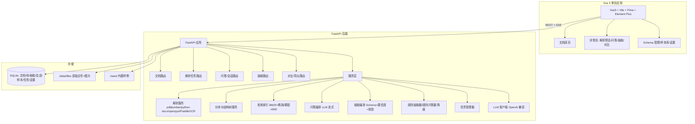
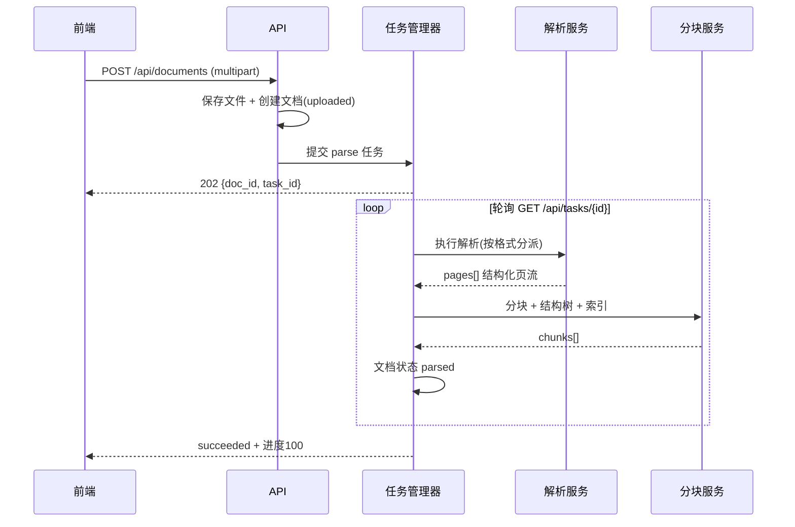
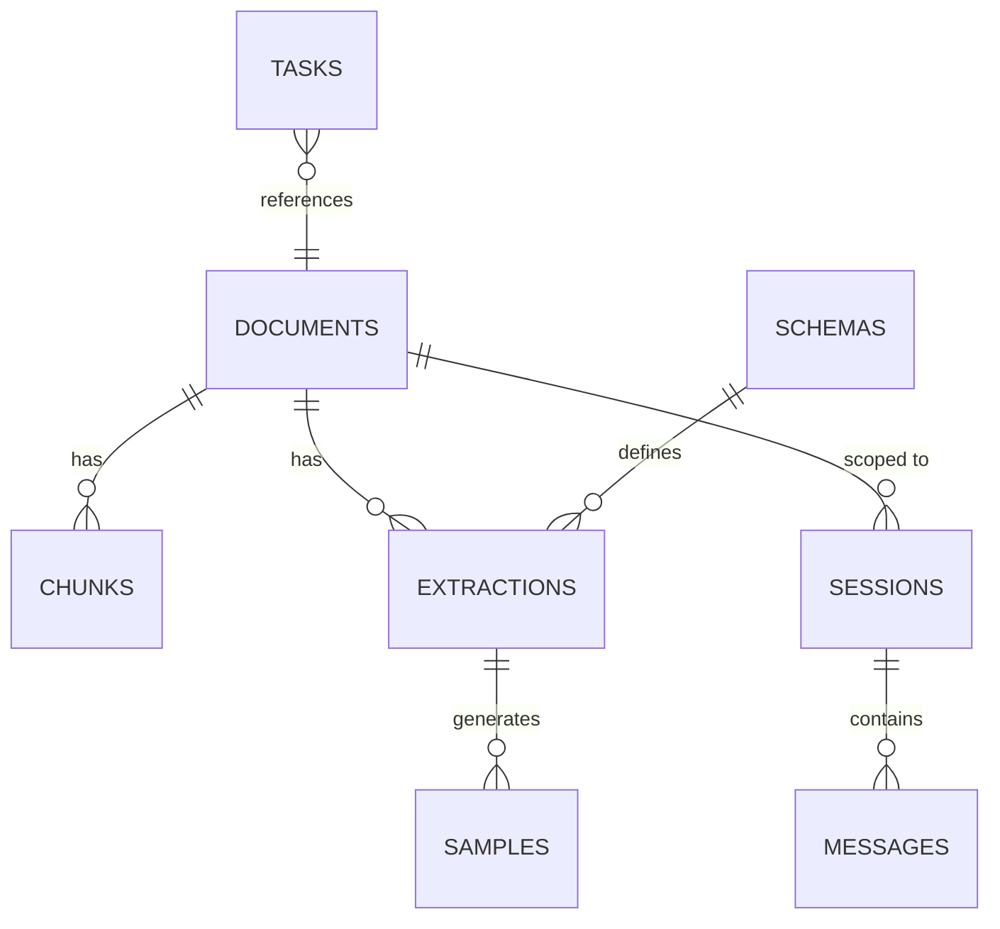

# DocMind 多模态文档智能助手 — 需求开发文档

| 项 | 内容 |
|---|---|
| 项目代号 | DocMind |
| 版本 | v1.0 |
| 文档状态 | 定稿（开发基线） |
| 作者 | 赵海蓺 |
| 定位 | 求职作品集主项目（AI 应用开发工程师） |

---

## 1. 项目概述

### 1.1 背景与动机

- 现有作品集已覆盖**结构化数据智能**（SmartQA，NL2SQL）与**检索评测**（Agent Memory Lab），缺少企业 AI 应用落地中最高频的**非结构化文档智能**能力。
- 市场上大量"PDF 聊天机器人"只做"抽文本 → 向量检索 → 问答"，同质化严重；DocMind 的差异化在于：**版式感知解析 + 结构化抽取 + 置信度标注 + 人工校验闭环 + 多文档对比**。
- 目标岗位为 AI 应用开发工程师，需要展示从解析、检索、模型编排、后端 API 到美观前端的完整闭环，且**面试官无需 API Key 即可浏览器体验**。

### 1.2 产品定位（一句话）

> 把合同、财报、扫描件变成"能问、能抽、能改、能导出"的智能文档——以**人机校验闭环**为核心差异的多模态文档智能助手。

### 1.3 目标用户与使用场景

| 用户 | 场景 |
|---|---|
| 面试官/访客 | 打开演示地址，一键加载内置合同/财报/扫描件样例，体验上传 → 解析 → 问答 → 抽取 → 校验 → 导出全流程 |
| 企业业务人员（目标形态） | 上传合同/财报，问答合同条款、抽取关键字段、人工核对修正、导出结构化结果 |
| 开发者（自用） | 自定义抽取 Schema，管理模型配置，导入自己的文档 |

### 1.4 成功标准（验收口径）

1. **演示闭环**：无任何 API Key 的情况下，可在浏览器完成样例加载、解析、问答（检索可用）、抽取（演示规则抽取器）、校验、导出。
2. **多模态覆盖**：PDF（文本+表格+图片）、Word、Excel、图片（扫描件 OCR，可降级提示）四类输入可解析。
3. **抽取可用性**：内置合同 Schema 与财报 Schema 在样例文档上字段抽取完整率 ≥ 90%（人工确认前为 draft，确认后为 confirmed）。
4. **引用可溯源**：问答每条回答引用可点击跳转到原文位置（页码 + 章节）。
5. **工程质量**：后端测试 ≥ 60 项通过；前端生产构建与单测通过；Docker Compose 一键起服务；GitHub Actions 全绿。
6. **前端美观**：通过"设计走查清单"（见 §8.7），页面无丑陋默认样式、状态完备（空态/加载/错误/成功）。

### 1.5 范围边界

**做**：
- 上传与管理 PDF / DOCX / XLSX / 图片文档
- 版式感知解析（标题层级、表格还原、图片提取、页码）
- 智能分块 + 文档结构树
- 单/多文档 RAG 问答（引用溯源、流式输出、多轮会话）
- 基于 Schema 的结构化抽取（JSON 校验、置信度、依据引用）
- 人工校验闭环（编辑、确认、修正样本回流、样本库管理）
- 同 Schema 双文档对比（字段级 diff + 文本级差异）
- 导出（JSON / Excel / Markdown）
- 内置样例 + 演示模式
- 模型与检索设置管理

**不做（或明确降级）**：
- 不做用户注册/登录/多租户（单机单用户，作品集定位）
- 不做 .xls 老格式（提示转存 .xlsx）
- 不做扫描件高精度 OCR 训练；OCR 为可选依赖，缺失时降级提示
- 不做在线协作编辑（多人同时编辑）
- 不做云端部署收费、不做鉴权体系（演示环境开放，但提供关闭演示模式的开关）

---

## 2. 名词与术语

| 术语 | 含义 |
|---|---|
| 文档（Document） | 用户上传的原始文件及其解析、索引、抽取等派生数据的聚合体 |
| 块（Chunk） | 解析后切分的最小检索单元，含类型（text/table/image）、章节路径、页码 |
| 结构树（Structure Tree） | 文档分块后按标题层级构建的目录树 |
| Schema | 抽取目标的结构化定义（字段名、类型、必填、提示词等） |
| 抽取任务（Extraction） | 对某文档按某 Schema 执行抽取产生的结果（draft / confirmed） |
| 置信度（Confidence） | 字段级别的 0-1 分数，来自模型自评 + 规则校验 |
| 修正样本（Correction Sample） | 人工确认时与模型结果不一致的字段快照，用于后续评测 |
| 引用（Citation） | 回答中指向某 chunk（页码+章节）的证据标记 |
| 任务（Task） | 解析/抽取/对比等耗时操作的进度抽象（pending/running/succeeded/failed） |
| 演示模式（Demo Mode） | 内置样例 + 预置问题 + 一键加载的访客体验模式 |
| 规则抽取器（Rule Extractor） | 无 LLM Key 时使用的正则/表格定位抽取实现，输出标注"演示数据" |

---

## 3. 功能需求

### 3.1 功能总览

| 编号 | 功能模块 | 优先级 |
|---|---|---|
| FR-01 | 文档上传与管理 | P0 |
| FR-02 | 版式感知解析 | P0 |
| FR-03 | 智能分块与结构树 | P0 |
| FR-04 | 文档问答（RAG + 引用溯源 + 流式） | P0 |
| FR-05 | 结构化抽取（Schema + 置信度 + 校验） | P0 |
| FR-06 | 人工校验闭环（编辑/确认/样本回流） | P0 |
| FR-07 | 多文档对比 | P1 |
| FR-08 | 导出（JSON/Excel/Markdown） | P0 |
| FR-09 | 演示模式（样例 + 预置问题） | P0 |
| FR-10 | 模型与系统设置 | P0 |
| FR-11 | 问答会话管理 | P1 |
| FR-12 | 任务与进度 | P0 |
| FR-13 | 数据管理（清空/重置） | P1 |

### 3.2 FR-01 文档上传与管理

- 支持格式：`.pdf` `.docx` `.xlsx` `.png` `.jpg` `.jpeg` `.webp`
- 上传方式：拖拽上传 + 文件选择器；单文件最大 50MB；同时可多文件（≤5 个）
- 上传即创建 Document 记录，状态流转：`uploaded → parsing → parsed → failed`
- 文档列表页：卡片/列表双视图；显示名称、类型图标、大小、状态徽标、解析时间；支持搜索（名称模糊）、按状态/类型过滤、删除（二次确认）、重新解析
- 文档详情页含 4 个页签：**解析预览 / 问答 / 抽取 / 对比**
- 验收要点：上传失败有明确错误提示；同名文件允许重复上传（时间戳后缀）；删除后关联块、抽取、会话一并清理

### 3.3 FR-02 版式感知解析

**输入与解析器**

| 格式 | 解析器 | 说明 |
|---|---|---|
| PDF | pdfplumber | 文本、表格、图片、页码、字号/坐标 |
| DOCX | python-docx | 按 Word 样式识别标题层级，表格转 Markdown |
| XLSX | openpyxl | 每个工作表转为表格块，首行作为表头 |
| 图片 | PaddleOCR（可选依赖） | 扫描件 OCR；未安装时文档可创建但解析失败并给出安装指引 |
| 图片（备选） | 视觉 LLM（可配置） | 支持视觉输入的 OpenAI 兼容模型，可在无 OCR 时经 API 识别 |

**版式感知规则**
1. **标题识别**：PDF 用字号 + 加粗 + 位置启发式；DOCX 用段落样式（Heading 1-3）；正则兜底（如"第X章/1.1/一、"）。
2. **表格还原**：pdfplumber 表格提取后转为 Markdown 表格（对齐表头、近似合并单元格）；表格独立成块，不混入正文。
3. **图片提取**：PDF 图片保存为文件，生成缩略图；块元数据记录图片路径与上下文标题。
4. **页码**：所有块携带页码（PDF 原生页码；DOCX/XLSX 近似为 1）。
5. **质量过滤**：页眉页脚/重复文本启发式去重；空页跳过；乱码检测（U+FFFD 或异常替换字符占比 > 5% 时告警并跳过该页）。
6. **解析产物**：结构化页流 `pages[]`（每页：blocks[]，block 含 kind/bbox/text/table/image_path/heading_level），落库并可在前端"解析预览"查看。

**验收要点**：内置合同 PDF 能识别标题层级与表格；财报 PDF 数字表格还原无损；扫描件在无 OCR 时给出友好降级提示。

### 3.4 FR-03 智能分块与结构树

- 分块策略（按优先级）：
  1. 以标题层级为边界切分（h1/h2/h3 之间的正文合并为一个块）
  2. 表格独立成块（`kind=table`）
  3. 图片块：图片 + 所在章节标题上下文（`kind=image`）
  4. 长块截断：块内容上限 1500 字符，按句子边界（。！？；换行）切分
  5. 短块合并：相邻同章节碎片（< 80 字符）合并
- 块元数据：`doc_id, seq, section_path, title, page, kind, char_count, token_estimate`
- 结构树：由块序列构建章节树（章节 → 子章节 → 内容块引用），用于前端目录导航与引用定位
- 索引：块内容写入检索索引（见 §6.4）
- **验收要点**：合同样例分块数 8-30 且章节归属正确；表格块不混入正文块；结构树与文档目录一致。

### 3.5 FR-04 文档问答（RAG）

**检索**
- 默认检索：**BM25（纯 Python 实现）+ 稠密向量（可配置 API Embedding）→ RRF 融合**，top_k 默认 6（可配置 3-10）
- 无 Embedding Key 时自动降级为 BM25 + 稀疏 hash 表征（复用 Agent Memory Lab 思路），保证演示可跑
- 检索范围：单文档（默认）或勾选多文档（跨文档检索）
- 检索过滤：可选仅文本块 / 包含表格块；按页码范围过滤（P2）

**生成**
- 上下文组装：引用块 + 文档名/章节路径/页码；上下文按 token 预算裁剪（默认 8k，可配置）
- 输出：SSE 流式文本；回答中标注引用 `[1] [2]`；引用列表含 chunk_id、页码、章节标题
- 规则：检索不到相关内容时必须回答"未在文档中找到相关信息"，禁止编造；回答语言跟随提问语言
- 多轮：会话上下文携带最近 8 轮消息；重问时允许追问
- 无 Key 降级：演示模式提供**规则问答器**（BM25 检索 + 命中块直接作为答案片段返回），UI 标注"演示检索模式"

**验收要点**：预置 10 个演示问题全部能命中正确原文并带引用；引用跳转定位准确；流式输出在前端逐字渲染。

### 3.6 FR-05 结构化抽取

**Schema 管理**
- 内置 Schema（种子数据）：
  - `contract` 合同要素：合同名称、甲方、乙方、签订日期、合同金额、币种、付款方式、交付期限、违约金条款、争议解决方式、有效期
  - `financial` 财报指标：报告期、营业收入、同比增长、净利润、同比增长、毛利率、资产负债率、每股收益、主营业务
- 每个字段定义：`key, label, type(string/number/date/list/object), required, description, example, prompt_hint, enum[]`
- 用户可新增/编辑/删除自定义 Schema（JSON 编辑器 + 表单两种模式）；删除前校验无关联抽取任务

**抽取执行**
- 输入：文档 + Schema → 创建抽取任务
- 流程：全文档按块分批喂给 LLM → 每批输出字段 JSON + 字段置信度 + 依据块引用 → 合并批次 → JSON Schema 校验
- 校验规则：类型转换（数字去千分位/货币符号、日期归一化）、必填缺失标记、枚举越界标记、数值范围合理性（如金额 > 0）
- 字段状态：`extracted`（高置信） / `unsure`（低置信 < 0.6 或校验异常） / `missing`（未提取到） / `invalid`（校验失败）
- 整体置信度 = 字段加权平均；校验失败自动重试一次（携带错误信息纠正）
- 无 Key 降级：**规则抽取器**（正则 + 表格定位）输出与 LLM 相同的数据结构，字段标注 `source: rule`，UI 明示"演示数据"

**验收要点**：合同样例抽取字段完整率 ≥ 90%；金额/日期类型校验正确；低置信字段可被人工识别。

### 3.7 FR-06 人工校验闭环

- 抽取结果页：字段表格（字段名 / 值 / 置信度徽标 / 状态 / 依据引用 / 编辑）
- 编辑：类型感知输入（number 数字校验、date 日期选择器、list 标签式增删、enum 下拉）
- 操作：
  - 保存草稿：仅更新 draft 数据
  - **确认**：生成 confirmed 快照；与模型原始值不一致的字段生成**修正样本**（含字段 key、模型值、人工值、依据引用、时间）写入样本库
  - 重新抽取：可再次发起抽取任务覆盖
- 样本库页面：列表（文档/Schema/字段/模型值/人工值/状态）、删除、导出 JSONL
- 修订记录：抽取任务历史列表（P2）

**验收要点**：编辑后保存、刷新不丢失；确认后样本正确生成；样本导出 JSONL 可被 Python 读取。

### 3.8 FR-07 多文档对比

- 前置条件：选择两个已完成解析的文档 + 同一 Schema
- 字段级对比：逐字段输出 文档A值 / 文档B值 / 状态（一致 / 变更 / 仅A有 / 仅B有 / 双方缺失）；金额等数值字段支持差异百分比
- 文本级对比：章节相似度（块级 BM25 相似度）标记 新增/删除/修改章节
- 输出：对比表格 + 可选 LLM 差异摘要（无 Key 时跳过摘要，表格仍可用）
- 导出：对比报告 Markdown / HTML
- **验收要点**：两版本合同对比能识别金额变更与条款新增；导出报告内容完整。

### 3.9 FR-08 导出

| 对象 | 格式 |
|---|---|
| 抽取结果 | JSON / Excel(.xlsx) / Markdown |
| 对比报告 | Markdown / HTML |
| 修正样本库 | JSONL |
| 文档解析文本 | Markdown（P2） |
| 问答会话 | Markdown（P2） |

- Excel 导出使用 openpyxl，带表头样式、字段状态颜色列
- 导出文件名：`{文档名}-{Schema名}-{时间戳}.{ext}`

### 3.10 FR-09 演示模式

- 内置样例（仓库 `seed/` 目录）：
  - `demo-contract.pdf` 购销合同（含金额、期限、违约条款、表格）
  - `demo-financial.pdf` 财报摘要（含营业收入、净利润等指标表格）
  - `demo-invoice.png` 扫描发票（OCR 依赖，缺失时提示）
- 一键加载：演示页三个样例卡片 → 点击 → 复制种子文件 → 自动解析 → 跳转详情
- 预置问题：问答页提供"示例问题"卡片（点击直接提问），覆盖：条款查询、金额计算、指标对比
- 预置 Schema：合同/财报已内置；演示模式不限制用户上传自己的文档
- **验收要点**：全新环境（空库）点三次卡片即可完成全流程演示，无需任何配置。

### 3.11 FR-10 模型与系统设置

- 模型配置：供应商预设（OpenAI / DeepSeek / 自定义 OpenAI 兼容）、Base URL、API Key（保存时脱敏显示）、模型名、temperature（0-2）、max_tokens
- 检索配置：top_k、RRF 融合权重（k1/k2）、块长度上限、是否启用稠密检索
- 测试连接：按钮调用 `/v1/models` 或最小 completion 验证配置
- 数据管理：清空全部数据（输入"DELETE"二次确认）；导出全部数据（P2，打包 zip）
- 配置持久化到 SQLite `settings` 表

### 3.12 FR-11 问答会话管理

- 会话 CRUD：创建（标题自动取首问前 20 字）、列表、删除
- 消息持久化：role / content / citations / created_at
- 会话绑定文档集合（可跨文档）；切换文档集合时新建会话或复用

### 3.13 FR-12 任务与进度

- 任务类型：`parse` / `extract` / `compare` / `demo_load`
- 状态机：`pending → running → succeeded | failed`；失败携带 error 信息（用户可读）
- 进度：0-100 + 阶段消息（如"正在解析第 3/12 页"）
- 前端：任务提交后轮询（1s）；解析/抽取完成后自动刷新对应页面
- 服务端：任务表持久化；重启后未完成任务标记 failed（"服务重启，任务中断"）

### 3.14 FR-13 数据管理

- 危险操作（删除全部文档/清空样本库/重置设置）需要二次确认；删除文档确认弹窗展示影响范围（关联块数、会话数）

---

## 4. 非功能需求

| 编号 | 类别 | 要求 |
|---|---|---|
| NFR-1 | 可演示性 | 无 API Key 时全流程可用（规则抽取器/规则问答器/OCR 降级提示），演示不依赖外网模型服务 |
| NFR-2 | 性能 | 10MB PDF 解析 ≤ 30s（单线程）；问答首 token ≤ 5s（含检索）；抽取 30 页文档 ≤ 3 分钟 |
| NFR-3 | 安全 | 所有上传文件仅存本地；文件名校验防路径穿越；API 限流（默认 60 req/min/IP）；Key 不回传前端明文 |
| NFR-4 | 可观测 | 结构化日志（loguru）：任务/模型调用耗时与 token 计数；/api/health 提供版本与存储状态 |
| NFR-5 | 可测试性 | 解析器、检索、抽取服务均以纯函数/服务类封装，可注入 mock LLM/OCR；测试使用临时目录与临时 SQLite |
| NFR-6 | 可部署性 | conda environment.yml + Dockerfile + docker-compose（后端+前端同源）+ Nginx；CI：pytest + 前端构建 + 镜像构建 |
| NFR-7 | 兼容性 | Python 3.11/3.12；Node 18+；Chrome/Edge 最新版；响应式布局适配 1280px+ 桌面 |
| NFR-8 | 数据一致性 | 删除文档级联清理；确认后的抽取不可被重新抽取静默覆盖（需显式操作） |
| NFR-9 | 优雅降级 | OCR 缺失 / Embedding 缺失 / LLM Key 缺失 / 网络失败 均有明确 UI 提示与回退路径 |

---

## 5. 系统架构

### 5.1 总体架构



### 5.2 模块划分与职责

| 模块 | 路径 | 职责 |
|---|---|---|
| API 层 | `backend/app/api/` | 路由、请求校验、响应模型、SSE |
| 服务层 | `backend/app/services/` | 解析、分块、索引、问答、抽取、对比、导出、任务 |
| 数据层 | `backend/app/storage/` | SQLite DAO、文件存储、种子数据 |
| 模型层 | `backend/app/models.py` | Pydantic 模型 + 状态枚举 |
| LLM 层 | `backend/app/llm/` | OpenAI 兼容客户端、提示词模板、流式解析、JSON 修复 |
| 降级层 | `backend/app/fallback/` | 规则抽取器、规则问答器、hash 嵌入 |
| 工具 | `backend/app/utils/` | 日志、限流、文件安全、文本工具 |
| 前端 | `frontend/` | Vue 3 应用（页面/组件/状态/API 封装） |
| 部署 | `deploy/` | Dockerfile、docker-compose.yml、nginx.conf |
| 测试 | `backend/tests/` `frontend/src/__tests__/` | 单元/集成测试 |
| 文档 | `docs/` | 需求文档、README、架构说明 |
| 样例 | `seed/` | 内置演示文档 |

### 5.3 技术选型与理由

| 层 | 选型 | 理由 |
|---|---|---|
| 后端 | Python 3.11 + FastAPI + uvicorn | 与现有作品一致，异步友好，SSE 原生支持 |
| 解析 | pdfplumber / python-docx / openpyxl | 纯 Python、表格与坐标能力强、离线 |
| OCR | PaddleOCR（可选依赖） | 中文扫描件效果好；缺失时优雅降级 |
| 存储 | SQLite（stdlib sqlite3 + 薄 DAO） | 单机作品零运维，JSON 字段灵活，避免 ORM 魔法 |
| 检索 | 自研 BM25 + hash 稀疏 + RRF；稠密可选 | 无重型向量库依赖，可离线可复现，体现检索功底 |
| 模型 | OpenAI 兼容 HTTP 客户端（httpx） | 兼容 DeepSeek/OpenAI/本地 Ollama，不绑定 LangChain |
| 前端 | Vue 3 + Vite + Pinia + Vue Router + Element Plus + ECharts | 与现有作品一致；ECharts 用于财报指标可视化 |
| 部署 | Docker Compose + Nginx 同源 + GitHub Actions | 浏览器演示闭环与 CI 全绿 |
| 测试 | pytest / httpx TestClient / vitest | 后端 + 前端双层质量门禁 |

### 5.4 核心流程

**解析流程**



**问答流程**：提问 → 检索 top_k（BM25+稠密+RRF）→ 组装上下文 → LLM 流式生成 → SSE 推送 tokens + citations（结束事件携带引用列表）→ 前端渲染 Markdown + 引用角标。

**抽取校验流程**：选择 Schema → 提交抽取任务 → 分批 LLM 抽取 → JSON 校验/置信度 → draft 落库 → 前端编辑 → 确认 → confirmed 快照 + 修正样本入库。

**对比流程**：选择同 Schema 双文档 → 字段级 diff + 章节相似度 → 差异摘要（可选 LLM）→ 结果表 + 导出。

---

## 6. 数据设计

### 6.1 实体关系



### 6.2 表结构（SQLite DDL）

```sql
CREATE TABLE documents (
  id INTEGER PRIMARY KEY AUTOINCREMENT,
  name TEXT NOT NULL,            -- 展示名（去扩展名）
  filename TEXT NOT NULL,        -- 存储文件名（uuid.ext）
  original_name TEXT NOT NULL,
  ext TEXT NOT NULL,
  mime TEXT,
  size_bytes INTEGER NOT NULL,
  status TEXT NOT NULL DEFAULT 'uploaded',  -- uploaded/parsing/parsed/failed
  parse_error TEXT,
  page_count INTEGER,
  char_count INTEGER,
  chunk_count INTEGER,
  created_at TEXT NOT NULL,
  updated_at TEXT NOT NULL
);

CREATE TABLE chunks (
  id INTEGER PRIMARY KEY AUTOINCREMENT,
  doc_id INTEGER NOT NULL REFERENCES documents(id) ON DELETE CASCADE,
  seq INTEGER NOT NULL,
  kind TEXT NOT NULL DEFAULT 'text',  -- text/table/image
  section_path TEXT,                  -- 如 "3.2 付款方式"
  title TEXT,
  content TEXT NOT NULL,
  page INTEGER,
  char_count INTEGER,
  token_estimate INTEGER,
  image_path TEXT,                    -- kind=image 时
  hash_vec TEXT,                      -- JSON 稀疏向量（降级稠密）
  created_at TEXT NOT NULL
);
CREATE INDEX idx_chunks_doc ON chunks(doc_id, seq);

CREATE TABLE schemas (
  id INTEGER PRIMARY KEY AUTOINCREMENT,
  key TEXT UNIQUE NOT NULL,           -- contract/financial/custom
  name TEXT NOT NULL,
  description TEXT,
  fields_json TEXT NOT NULL,          -- [FieldDef...]
  is_builtin INTEGER NOT NULL DEFAULT 0,
  created_at TEXT NOT NULL
);

CREATE TABLE extractions (
  id INTEGER PRIMARY KEY AUTOINCREMENT,
  doc_id INTEGER NOT NULL REFERENCES documents(id) ON DELETE CASCADE,
  schema_id INTEGER NOT NULL REFERENCES schemas(id),
  status TEXT NOT NULL DEFAULT 'draft',   -- draft/confirmed
  data_json TEXT,                         -- {field_key: value}
  confidence_json TEXT,                   -- {field_key: 0-1}
  field_status_json TEXT,                 -- {field_key: extracted/unsure/missing/invalid}
  citations_json TEXT,                    -- {field_key: [chunk_id...]}
  source TEXT NOT NULL DEFAULT 'llm',     -- llm/rule
  llm_raw TEXT,                           -- 模型原始输出（调试）
  error TEXT,
  confirmed_at TEXT,
  created_at TEXT NOT NULL,
  updated_at TEXT NOT NULL
);

CREATE TABLE samples (
  id INTEGER PRIMARY KEY AUTOINCREMENT,
  extraction_id INTEGER REFERENCES extractions(id) ON DELETE SET NULL,
  doc_id INTEGER NOT NULL,
  schema_id INTEGER NOT NULL,
  field_key TEXT NOT NULL,
  model_value TEXT,
  human_value TEXT NOT NULL,
  citation TEXT,
  created_at TEXT NOT NULL
);

CREATE TABLE sessions (
  id INTEGER PRIMARY KEY AUTOINCREMENT,
  title TEXT NOT NULL,
  doc_ids TEXT NOT NULL DEFAULT '[]',   -- JSON 数组
  created_at TEXT NOT NULL
);

CREATE TABLE messages (
  id INTEGER PRIMARY KEY AUTOINCREMENT,
  session_id INTEGER NOT NULL REFERENCES sessions(id) ON DELETE CASCADE,
  role TEXT NOT NULL,                   -- user/assistant/system
  content TEXT NOT NULL,
  citations_json TEXT,                  -- [Citation...]
  source TEXT DEFAULT 'llm',            -- llm/rule
  created_at TEXT NOT NULL
);

CREATE TABLE tasks (
  id INTEGER PRIMARY KEY AUTOINCREMENT,
  kind TEXT NOT NULL,                   -- parse/extract/compare/demo_load
  status TEXT NOT NULL DEFAULT 'pending', -- pending/running/succeeded/failed
  progress INTEGER NOT NULL DEFAULT 0,
  message TEXT,
  payload_json TEXT,                    -- 任务参数（doc_id 等）
  result_json TEXT,                     -- 结果摘要（如 extraction_id）
  error TEXT,
  created_at TEXT NOT NULL,
  finished_at TEXT
);

CREATE TABLE settings (
  key TEXT PRIMARY KEY,
  value_json TEXT NOT NULL
);
```

### 6.3 关键 JSON 结构

**Chunk**
```json
{
  "id": 12, "doc_id": 1, "seq": 4, "kind": "table",
  "section_path": "3. 合同主要条款", "title": "3.2 付款方式",
  "content": "| 付款阶段 | 比例 | 时间 |\n|---|---|---|\n| 预付款 | 30% | 合同签订后5日内 |",
  "page": 3, "char_count": 220, "token_estimate": 90
}
```

**FieldDef（Schema 字段）**
```json
{
  "key": "contract_amount", "label": "合同金额", "type": "number",
  "required": true, "description": "合同总金额（人民币元）",
  "example": "1200000", "prompt_hint": "包含大小写金额，取大写数字金额", "enum": []
}
```

**Extraction（draft）**
```json
{
  "id": 3, "doc_id": 1, "schema_id": 1, "status": "draft", "source": "llm",
  "data": {"contract_amount": 1200000.0, "party_a": "华信科技有限公司"},
  "confidence": {"contract_amount": 0.95, "party_a": 0.88},
  "field_status": {"contract_amount": "extracted", "payment_method": "missing"},
  "citations": {"contract_amount": [12, 13]}
}
```

**Citation**
```json
{"chunk_id": 12, "page": 3, "section": "3.2 付款方式", "snippet": "预付款 30%..."}
```

### 6.4 检索索引设计

- **BM25**：纯 Python 实现（tokenize 中文按 2-gram + 英文按词），构建 doc 频次表；查询时 top_k 召回
- **稀疏 hash 表征**：hash(token) % 4096 的计数向量，余弦相似度（降级"稠密"）
- **稠密向量（可选）**：OpenAI 兼容 `/embeddings`，存 JSON 数组
- **RRF 融合**：`score = Σ 1/(k + rank_i)`，k=60；top_k 默认 6
- 索引在解析完成后构建，存于内存 + 可从 chunks 表重建（重启不丢）

---

## 7. 接口设计

### 7.1 通用约定

- 前缀 `/api`；JSON 响应；错误格式 `{"detail": "用户可读信息"}`（FastAPI 默认）
- 分页：`?page=1&page_size=20` → `{"items": [...], "total": n}`
- 时间：ISO 8601 字符串（UTC+8 本地时间）
- SSE 端点返回 `text/event-stream`

### 7.2 接口清单

| 方法 | 路径 | 说明 |
|---|---|---|
| GET | /api/health | 健康检查（版本/存储状态/功能可用性） |
| POST | /api/documents | 上传文档（multipart）→ 202 |
| GET | /api/documents | 文档列表（搜索/过滤/分页） |
| GET | /api/documents/{id} | 文档详情 |
| DELETE | /api/documents/{id} | 删除（级联） |
| POST | /api/documents/{id}/reparse | 重新解析 |
| GET | /api/documents/{id}/structure | 结构树 |
| GET | /api/documents/{id}/chunks | 块列表（分页） |
| GET | /api/documents/{id}/pages | 解析页流（解析预览） |
| GET | /api/media/{doc_id}/{filename} | 图片/缩略图静态访问 |
| POST | /api/documents/{id}/chat | 问答（JSON 或 SSE 流式） |
| GET/POST | /api/sessions | 会话列表/创建 |
| GET | /api/sessions/{id}/messages | 消息列表 |
| DELETE | /api/sessions/{id} | 删除会话 |
| GET/POST | /api/schemas | Schema 列表/创建 |
| GET/PUT/DELETE | /api/schemas/{id} | Schema 详情/更新/删除 |
| POST | /api/documents/{id}/extract | 提交抽取任务 → 202 |
| GET | /api/documents/{id}/extractions | 该文档抽取列表 |
| GET | /api/extractions/{id} | 抽取详情 |
| PUT | /api/extractions/{id} | 保存草稿（字段编辑） |
| POST | /api/extractions/{id}/confirm | 确认 → 生成样本 |
| POST | /api/extractions/{id}/reextract | 重新抽取 |
| GET | /api/samples | 样本库列表（过滤/分页） |
| DELETE | /api/samples/{id} | 删除样本 |
| GET | /api/samples/export | 导出 JSONL |
| POST | /api/compare | 提交对比任务 → 202 |
| GET | /api/compares/{id} | 对比结果 |
| GET | /api/export/extraction/{id}?format=json\|xlsx\|md | 导出抽取结果 |
| GET | /api/export/compare/{id}?format=md\|html | 导出对比报告 |
| GET/POST | /api/demo | 演示信息/一键加载样例 |
| GET | /api/tasks/{id} | 任务详情（轮询） |
| GET | /api/tasks | 任务列表 |
| GET/PUT | /api/settings | 读取/更新设置 |
| POST | /api/settings/test | 测试模型连接 |
| POST | /api/data/reset | 清空全部数据 |

### 7.3 关键接口详述

**POST /api/documents**
```
Request: multipart/form-data; file=@合同.pdf
Response 202:
{
  "document": {"id": 1, "name": "合同", "status": "uploaded", ...},
  "task": {"id": 10, "kind": "parse", "status": "pending"}
}
```

**POST /api/documents/{id}/chat**（流式）
```
Request:
{
  "session_id": 5,           // 可选，缺省自动创建
  "question": "合同金额是多少？",
  "doc_ids": [1],            // 默认当前文档
  "stream": true
}
Response: text/event-stream
event: meta      data: {"session_id": 5, "message_id": 22}
event: delta     data: {"text": "合同金额为"}
event: delta     data: {"text": " 120 万元"}
event: done      data: {"citations": [{"chunk_id":12,"page":3,"section":"3.2 付款方式"}], "source": "llm", "usage": {...}}
event: error     data: {"message": "..."}
```

**POST /api/documents/{id}/extract**
```
Request: {"schema_id": 1}
Response 202: {"task": {"id": 11, "kind": "extract", "status": "pending"}}
```

**PUT /api/extractions/{id}**
```
Request: {"data": {"contract_amount": 1300000.0, ...}}
Response: {"id": 3, "status": "draft", "data": {...}, "updated_at": "..."}
```

**POST /api/extractions/{id}/confirm**
```
Response: {"id": 3, "status": "confirmed", "samples_created": 2, "confirmed_at": "..."}
```

**POST /api/compare**
```
Request: {"doc_a": 1, "doc_b": 2, "schema_id": 1}
Response 202: {"task": {...}}
GET /api/compares/{id} →
{
  "field_diff": [{"key": "contract_amount", "label": "合同金额",
    "value_a": 1200000, "value_b": 1300000, "status": "changed", "delta_pct": 8.3}],
  "section_diff": [{"title": "3.2 付款方式", "status": "changed", "similarity": 0.72}],
  "summary": "两份合同的差异主要是合同金额从 120 万变更为 130 万...",  // 可选
  "source": "llm" | "rule"
}
```

**GET /api/demo**
```
Response: {
  "samples": [
    {"kind": "contract", "name": "购销合同样例", "path_hint": "含金额/期限/违约条款表格"},
    {"kind": "financial", "name": "财报摘要样例", "path_hint": "含营业收入/净利润指标"},
    {"kind": "invoice", "name": "扫描发票样例", "path_hint": "需 OCR 或视觉模型"}
  ],
  "questions": ["合同金额是多少？", "付款方式有哪些？", "违约金比例是多少？", "净利润同比增长多少？"]
}
```

### 7.4 SSE 事件协议

| 事件 | 数据 | 触发 |
|---|---|---|
| meta | 会话/消息 id | 流开始 |
| delta | 文本增量 | 每 token 片段 |
| done | 引用/来源/token 用量 | 流结束 |
| error | 错误信息 | 失败中断 |


---

## 8. 前端设计

### 8.1 设计原则（美观要求）

1. **专业感优先**：整体视觉定位"企业级文档智能工作台"，避免玩具感；主色深蓝 + 青色强调，大面积留白。
2. **状态完备**：每个页面必须有 加载（骨架屏）/ 空态（插画+引导）/ 错误（可重试）/ 成功 四种状态。
3. **动效克制**：过渡 150-250ms；流式回答逐字渲染；任务进度条平滑；避免无意义弹跳。
4. **信息层级**：卡片化布局，主操作按钮固定位置；表格密度适中；置信度用颜色徽标（绿/黄/红）。
5. **一致性**：统一间距体系（4/8/12/16/24/32）、圆角（8/12/16）、字体（中文苹方/微软雅黑，英文 Inter 风格系统字体）、阴影（柔和分层）。
6. **可演示性**：访客 30 秒内理解"能做什么"：首页即演示入口，样例卡片 + 步骤引导。

### 8.2 视觉规范

| 项 | 规范 |
|---|---|
| 主色 | `#1F6FEB`（蓝）渐变 `#0E7490`（青），深色导航 `#102A43` |
| 语义色 | 成功 `#16A34A` / 警告 `#D97706` / 危险 `#DC2626` / 中性 `#64748B` |
| 背景 | 主背景 `#F6F8FB`，卡片 `#FFFFFF`，边框 `#E2E8F0` |
| 字体 | 中文 `PingFang SC / Microsoft YaHei`，数字 `tabular-nums` |
| 圆角 | 卡片 12px，按钮/输入 8px，徽标全圆 |
| 阴影 | `0 1px 2px rgba(16,42,67,.06), 0 4px 12px rgba(16,42,67,.08)` |
| 暗色模式 | P1：深色背景 `#0F172A` 系，随系统偏好 + 手动切换 |

### 8.3 页面结构

```
/                      工作台（演示入口 + 统计 + 最近文档）
/documents             文档库（列表/卡片切换、上传、搜索过滤）
/documents/:id         文档详情
  └ 页签: 解析预览 / 问答 / 抽取 / 对比
/schemas               Schema 管理
/samples               修正样本库
/settings              模型与系统设置
```

### 8.4 页面详述

**工作台 `/`**
- 顶部 Hero：项目名 DocMind + 一句话定位 + 主按钮"体验演示"
- 三个样例卡片（合同/财报/扫描发票）：图标 + 说明 + "一键加载"按钮；加载中按钮转 loading，完成后跳转详情
- 统计区：文档数 / 已解析 / 抽取确认数 / 样本数（小卡片）
- 最近文档列表（最近 5 条）+ "全部文档"入口
- 底部：能力说明三卡片（版式感知解析 / 溯源问答 / 抽取校验闭环）

**文档库 `/documents`**
- 顶部工具条：上传按钮（拖拽区 hover 高亮）+ 搜索框 + 状态/类型过滤
- 卡片视图：类型图标（PDF/Word/Excel/图片）+ 名称 + 大小 + 状态徽标 + 时间；hover 显示"打开/删除"
- 空态：引导插画 + "上传第一份文档"按钮
- 上传进度：任务轮询，卡片显示进度条 + 阶段文案

**解析预览页签**
- 左侧：文档结构树（可折叠章节，点击定位）
- 右侧：页流预览（文本块/表格渲染/Markdown 表格样式），图片块显示图片缩略图；块 hover 高亮并显示页码徽标
- 顶部：解析统计（页数/块数/字符数）+ "重新解析"按钮

**问答页签**
- 左侧：会话列表（新建会话、删除）
- 右侧：消息流（用户气泡右侧、助手左侧、Markdown 渲染 + 引用角标 `[1]`）；流式逐字渲染；引用面板点击 → 弹出原文定位抽屉（显示对应块内容 + 高亮）
- 底部：输入框（多行自适应、Enter 发送、Shift+Enter 换行）+ 文档范围选择器（默认当前文档）+ 示例问题卡片（点击即发）
- 空态：欢迎语 + 示例问题；检索降级时显示"演示检索模式"提示条

**抽取页签**
- 顶部：Schema 选择器（内置/自定义）+ "开始抽取"按钮 + 任务进度
- 抽取结果表格：字段名 | 值（可编辑）| 置信度（进度条+徽标）| 状态 | 依据（引用跳转）
- 字段编辑：点击单元格进入编辑（类型感知输入），失焦保存草稿；"确认结果"主按钮（二次确认弹窗，提示将生成修正样本）
- 整体置信度卡片 + 来源标注（LLM / 规则演示）
- 导出按钮组：JSON / Excel / Markdown

**对比页签**
- 选择目标文档（同 Schema 文档下拉）+ Schema → "开始对比"
- 字段差异表：A 值 | B 值 | 状态徽标（一致/变更/仅A/仅B）| 差异百分比
- 章节差异列表：章节名 + 状态徽标 + 相似度条
- 差异摘要卡片（LLM 可用时）+ 导出按钮（MD/HTML）

**Schema 管理 `/schemas`**
- 内置 Schema 卡片（只读标记）+ 自定义 Schema 列表
- 新建/编辑：表单模式（字段表格增删：key/label/type/required/描述）+ JSON 模式切换
- 校验：key 唯一、type 合法、必填字段有 label

**样本库 `/samples`**
- 表格：文档 | Schema | 字段 | 模型值 | 人工值 | 时间；过滤 + 导出 JSONL + 删除

**设置 `/settings`**
- 模型卡片：供应商预设下拉、Base URL、API Key（password 输入，回显脱敏）、模型名、temperature/max_tokens 滑块、测试连接按钮（成功/失败 toast）
- 检索卡片：top_k 滑块、RRF 权重、块长度上限、稠密检索开关
- 数据卡片：清空全部数据（红色危险区，输入 DELETE 确认）

### 8.5 关键组件

| 组件 | 说明 |
|---|---|
| `DocIcon.vue` | 按扩展名渲染文件类型图标（颜色区分） |
| `StatusBadge.vue` | 文档/任务状态徽标（颜色+文案映射） |
| `ConfidenceBar.vue` | 置信度进度条 + 阈值变色 |
| `CitationChip.vue` | 引用角标，点击触发原文抽屉 |
| `SourceDrawer.vue` | 原文定位抽屉（块内容 + 高亮关键字） |
| `MarkdownView.vue` | 安全 Markdown 渲染（highlight.js 代码高亮） |
| `StreamText.vue` | 流式文本逐字渲染（打字机，可中断） |
| `FileDropzone.vue` | 拖拽上传（多文件、格式校验、大小校验） |
| `EmptyState.vue` | 空态插画 + 文案 + 动作按钮 |
| `SchemaForm.vue` | 字段定义表格编辑器（表单/JSON 双模式） |
| `FieldCellEditor.vue` | 类型感知字段编辑（number/date/list/enum） |
| `CompareTable.vue` | 对比结果表（状态徽标 + 差异高亮） |

### 8.6 技术要点

- Pinia 状态：`useDocsStore` `useTaskStore` `useChatStore` `useSettingsStore`
- API 封装：`src/api/` 统一 axios/fetch 实例，SSE 用 `fetch + ReadableStream` 解析
- 路由懒加载 + 页面级骨架屏；ECharts 按需引入（财报指标条形图）
- 前端单测（vitest）：状态徽标映射、流式解析器、字段编辑器校验逻辑

### 8.7 设计走查清单（验收用）

- [ ] 无浏览器默认样式裸露（按钮/输入/滚动条一致）
- [ ] 所有页面四种状态（加载/空/错/成功）可用
- [ ] 键盘可用：输入框 Enter 发送、弹窗 Esc 关闭、焦点可见
- [ ] 1280×800 与 1920×1080 下无错位
- [ ] 流式输出无卡顿；长文档列表滚动流畅
- [ ] 颜色对比度满足可读性；错误提示不遮挡内容
- [ ] 暗色模式下无刺眼纯白区块（若实现）

---

## 9. 里程碑规划（无时间线）

> 里程碑按依赖顺序排列，每个里程碑有明确的**交付物**与**验收标准**；不设日期，完成一个再进入下一个。

### M1 项目骨架与工程基线
- 交付物：GitHub 仓库 `docmind`；目录结构（backend/frontend/deploy/seed/docs）；`environment.yml`、`requirements.txt`；pytest + vitest 空跑；CI 骨架（lint + test + build）；README 初稿；本需求文档定稿入库
- 验收：`git clone` 后按 README 两条命令可启动空前后端；CI 全绿；需求文档与仓库一致

### M2 文档解析层
- 交付物：上传/列表/删除 API；存储层（SQLite + 文件）；解析服务（PDF/DOCX/XLSX/图片）；分块服务；结构树；任务管理器（parse）
- 验收：三种样例解析成功且块/结构树正确；10MB 内 PDF 解析 ≤30s；后端测试 ≥15 项；解析预览接口返回页流

### M3 检索问答层
- 交付物：BM25 + 稀疏 hash + 可选稠密 + RRF 索引；问答编排（流式 + 引用）；会话 CRUD；规则问答器降级；SSE
- 验收：预置 10 问全部命中正确引用；无 Key 时规则问答可用；SSE 前端逐字渲染；测试 ≥25 项

### M4 抽取与校验层
- 交付物：Schema CRUD；抽取任务（LLM 分批 + 校验 + 置信度）；规则抽取器；编辑/确认/样本；导出（JSON/Excel/MD）
- 验收：合同样例字段完整率 ≥90%；确认生成样本正确；三种导出文件可打开；测试 ≥40 项

### M5 对比与演示
- 交付物：对比任务（字段 diff + 章节相似度 + 摘要）；演示模式（样例加载 + 预置问题）；导出对比报告
- 验收：双文档对比结果人工核对正确；全新空库一键加载三样例可用；测试 ≥50 项

### M6 前端完整实现与美化
- 交付物：全部页面与组件；设计走查清单全过；暗色模式（P1）
- 验收：§8.7 清单逐项勾选通过；`npm run build` 无警告；交互走查无阻塞

### M7 部署与工程化
- 交付物：Dockerfile + docker-compose + nginx.conf；CI 全绿（pytest/vitest/build/镜像）；README 完整（含在线演示说明）；端口与安全配置
- 验收：全新机器 `docker compose up` 后浏览器全流程可用；CI 状态徽章通过

### M8 质量门禁（bug 审查 + 代码审查）
- 交付物：bug 审查清单执行记录（见 §10.4）；代码审查记录；所有 P0/P1 问题关闭；验收演示脚本（`docs/acceptance.md` 可复现）
- 验收：P0=0、P1=0；审查意见全部闭环；演示脚本从头到尾通过

---

## 10. 测试策略

### 10.1 测试层级

| 层级 | 工具 | 覆盖 |
|---|---|---|
| 单元 | pytest | 解析器、分块规则、BM25/RRF、校验器、置信度、导出器 |
| 集成 | pytest + TestClient | API 全流程（上传→解析→问答→抽取→确认→导出）、SSE |
| 前端单测 | vitest | 徽标映射、流式解析、字段编辑器、工具函数 |
| 构建门禁 | npm run build / pytest | 前后端生产构建 |
| 手工验收 | docs/acceptance.md | 浏览器全流程 + 设计走查 |

### 10.2 关键测试用例

- 解析：PDF 标题识别、表格还原、图片提取、空页跳过、乱码页跳过、DOCX 样式标题、XLSX 工作表分块、非法扩展名 422
- 分块：长块截断、短块合并、表格独立、结构树章节正确
- 检索：中文 2-gram 命中、RRF 融合排序、无 Key 降级、top_k 边界
- 问答：引用格式、未找到答案兜底、流式事件序列、会话持久化、多文档范围
- 抽取：字段类型校验（金额千分位/日期）、必填缺失、置信度阈值、重试逻辑、规则抽取器输出结构一致
- 校验闭环：编辑草稿保存、确认生成样本、样本导出 JSONL、重新抽取覆盖
- 对比：字段 diff 状态、章节相似度、导出
- 安全：文件名路径穿越、超大文件拒绝、未登录无鉴权下的限流生效
- 数据：删除文档级联清理、重置全部数据

### 10.3 测试数据与 Fixture

- `tests/fixtures/`：迷你 PDF（reportlab 生成，含标题/表格/图片）、mini.docx、mini.xlsx、迷你图片
- 种子样例直接复用 `seed/`（合同/财报/发票）
- LLM/OCR 全部可注入 mock：`FakeLLM`（按关键词返回固定 JSON）、`FakeOCR`

### 10.4 Bug 审查清单（M8 执行）

| 类别 | 检查项 |
|---|---|
| 数据 | 删除级联、任务失败重试、重启后状态一致、并发提交同一文档解析 |
| 输入 | 空文件、超大文件、中文/特殊字符文件名、路径穿越、恶意 HTML（XSS 转义） |
| 流式 | SSE 断连、半途失败事件、重复轮询 |
| 前端 | 快速点击重复提交、上传中离开页面、空数据渲染崩溃、长文本溢出 |
| 权限 | 越权访问他人文档 id（无鉴权下至少校验存在性）、Key 泄露到前端 |
| 性能 | 大文档解析卡死事件循环（解析放线程池）、列表页大数据量 |
| 兼容 | PDF 无文本层（纯扫描）提示、损坏文件解析崩溃恢复 |

---

## 11. 部署与运维

- 本地开发：conda 环境 `docmind` + 前端 `npm run dev`（Vite 代理 /api 到 8000）
- 生产：`docker compose up -d` → 前端产物由 Nginx 托管，反代 `/api` 与 `/api/media` 到 FastAPI
- 端口：默认 18002（与既有作品 18001/18003 错开）
- 数据卷：`./data`（SQLite + 上传文件 + 图片）挂载持久化；`seed/` 只读内置
- CI：GitHub Actions：pytest → vitest → 前端构建 → Docker 镜像构建（推 Docker Hub，secrets 配置后触发服务器部署）
- 健康检查：`/api/health` 返回版本、存储可写、功能降级状态（ocr/embedding/llm 是否可用）

---

## 12. 风险与对策

| 风险 | 影响 | 对策 |
|---|---|---|
| 复杂 PDF 版式还原不完美 | 解析质量 | 解析器抽象 + 内置样例保证演示效果；解析预览允许用户查看原始块文本 |
| PaddleOCR 安装体积大 | 环境/CI 负担 | 可选依赖，requirements-ocr.txt 分离；CI 不装 OCR，用 FakeOCR 测试 |
| 无 LLM Key 演示降级体验 | 问答/抽取效果打折 | 规则问答/规则抽取保证链路完整 + UI 明示演示模式；提供 Ollama 配置指引 |
| SSE 在部分代理中断 | 流式体验 | 前端自动重连 + 轮询兜底（非流式 JSON 模式） |
| 抽取 LLM 输出不稳定 | 校验失败 | JSON 修复层（提取代码块/括号配对）+ 自动重试一次 + 字段级置信度 |
| 前端工作量超预期 | 延期 | 组件先行（M6 前骨架）；核心页签优先级：问答 > 抽取 > 解析预览 > 对比 |

---

## 13. 附录

### 13.1 内置 Schema 定义（种子）

**contract**
| key | label | type | required |
|---|---|---|---|
| contract_name | 合同名称 | string | true |
| party_a | 甲方 | string | true |
| party_b | 乙方 | string | true |
| sign_date | 签订日期 | date | true |
| contract_amount | 合同金额（元） | number | true |
| currency | 币种 | string | false |
| payment_method | 付款方式 | string | false |
| delivery_term | 交付期限 | string | false |
| penalty_clause | 违约金条款 | string | false |
| dispute_resolution | 争议解决方式 | string | false |
| valid_period | 有效期 | string | false |

**financial**
| key | label | type | required |
|---|---|---|---|
| report_period | 报告期 | string | true |
| revenue | 营业收入（万元） | number | true |
| revenue_yoy | 营业收入同比（%） | number | false |
| net_profit | 净利润（万元） | number | true |
| profit_yoy | 净利润同比（%） | number | false |
| gross_margin | 毛利率（%） | number | false |
| debt_ratio | 资产负债率（%） | number | false |
| eps | 每股收益（元） | number | false |
| main_business | 主营业务 | string | false |

### 13.2 提示词模板要点

- **问答**：系统提示包含文档清单、检索块（含页码）、引用规则（`[n]` 必须对应提供的块）、未找到兜底要求、语言跟随
- **抽取**：系统提示包含 Schema 字段定义 JSON、输出格式要求（字段+confidence+citations）、只输出 JSON 的指令、分批说明
- **JSON 修复**：从输出中提取首个 `{...}` 代码块 → json.loads → 失败时尝试括号修复与非法字符清理

### 13.3 验收演示脚本（docs/acceptance.md 将落为可复现步骤）

1. 全新环境启动 → 打开首页
2. 点击"合同样例"一键加载 → 自动解析成功
3. 问答页点击示例问题 → 流式回答 + 引用跳转原文
4. 抽取页选"合同要素" → 抽取完成 → 修改一个字段 → 确认 → 样本库出现修正样本
5. 再加载"财报样例" → 抽取财报指标 → 对比两文档（同 Schema）→ 导出报告
6. 导出 JSON/Excel → 文件可打开
7. 无 Key 环境：以上 2-6 全部可完成（规则模式 + 降级提示可见）
8. 设计走查清单逐项通过
